# MyHomelab Kubernetes Cluster

## Overview
This document provides an overview of the Kubernetes cluster setup for my homelab environment.

## Prerequisites
- `kubectl` and `helm` command-line tool configured to communicate with your cluster

## Design

Host Name                   | IP Address        | Network Mask      | Default Gateway   | DNS       |
|---------------------------|-------------------|-------------------|-------------------|-----------|
| homelab-k8s-controller01    | 192.168.86.21     | 192.168.86.0/24   | 192.168.86.1      | 8.8.8.8   |
| homelab-k8s-controller02	| 192.168.86.22     | 192.168.86.0/24   | 192.168.86.1      | 8.8.8.8   |
| homelab-k8s-worker01        |192.168.86.25      | 192.168.86.0/24   | 192.168.86.1      | 8.8.8.8   |
| homelab-k8s-worker02        |192.168.86.26      | 192.168.86.0/24   | 192.168.86.1      | 8.8.8.8   |
| homelab-k8s-lb              |192.168.86.29      | 192.168.86.0/24   | 192.168.86.1      | 8.8.8.8   |
| homelab-k8s-nfs             |192.168.86.30      | 192.168.86.0/24   | 192.168.86.1      | 8.8.8.8   |

## Connectivity

### Control plane (Master nodes)

Port	        | Protocol	| Component                 |Purpose
----------------|-----------|---------------------------|---------------------------------------------------------------------------------------|
2379, 2380      | TCP	    | etcd	                    | etcd server client API and peer communication (used by the control plane)             |
6443	        | TCP   	| kube-apiserver	        | Kubernetes API server communication (kubectl, kubelet, and cluster components)        |
10257	        | TCP   	| kube-controller-manager   | Secure port for the Kubernetes controller manager to serve HTTPS metrics and health   |
10259	        | TCP   	| kube-scheduler	        | Secure port for the Kubernetes scheduler to serve HTTPS metrics and health            |
10250 & 10248   | TCP   	| kubelet	                | Communication between the API server and the kubelet on the master node               |
10249 & 10256   | TCP   	| kube-proxy	            |                                                                                       |
2381	        | TCP   	| CoreDNS	                | It's used for CoreDNS’s internal DNS service within the Kubernetes network            |
53	            | UDP   	| DNS	                    | Used by kube-dns                                                                      |
9099            | TCP       | Calico                    | Network Add-on                                                                        |
10260	        | TCP   	| Webhook	                | Webhooks are commonly used for admission control and validation, default port changed |

### Worker nodes

Port	        | Protocol	| Component                 |Purpose
----------------|-----------|---------------------------|---------------------------------------------------------------------------------------|
2381	        | TCP   	| CoreDNS	                | It's used for CoreDNS’s internal DNS service within the Kubernetes network            |
10250 & 10248   | TCP   	| kubelet	                | Communication between the API server and the kubelet on the master node               |
10249 & 10256   | TCP   	| kube-proxy	            |                                                                                       |
9099            | TCP       | Calico                    | Network Add-on                                                                        |
53	            | UDP   	| DNS	                    | Used by kube-dns                                                                      |
10260	        | TCP   	| Webhook	                | Webhooks are commonly used for admission control and validation, default port changed |
            
### Load Balancer

Port	        | Protocol	| Component                 |Purpose
----------------|-----------|---------------------------|---------------------------------------------------------------------------------------|
6443	        | TCP   	| kube-apiserver	        | Kubernetes API server communication (kubectl, kubelet, and cluster components)        |
2381	        | TCP   	| CoreDNS	                | It's used for CoreDNS’s internal DNS service within the Kubernetes network            |
53	            | UDP   	| DNS	                    | Used by kube-dns                                                                      |


## Set up the virtual machines in Proxmox

Set up the following virtual machines. Use a proxmox template. Enable SSH, add the public keys, upgrade the system, set up automatic upgrades.

- Two controller nodes: 
    - 4 GB of Memory
    - 2 vCPU
    - 32 GB of Storage
- Two working nodes: 
    - 4 GB or Memory
    - 2 vCPU 
    - 16 GB of Storage
- One load balancer
    - 2 GB or Memory
    - 2 vCPU 
    - 16 GB of Storage
- One NFS server
    - 4 GB of Memory
    - 2 vCPU 
    - 200 GB of Storage

## Preliminaries

- Point to Google DNS Server
    
    ```sh
    sudo sed -i -e 's/#DNS=/DNS=8.8.8.8/' /etc/systemd/resolved.conf
    service systemd-resolved restart
    ```

- Update the repositories and upgrade all packages

    ```sh
    sudo apt update
    sudo apt upgrade
    reboot
    sudo apt install nala
    ```

- Install basic commands
    
    ```sh
    sudo nala install iputils-ping dnsutils netcat-openbsd apt-transport-https vim -y
    sudo nala install ca-certificates curl gnupg netcat-openbsd software-properties-common -y
    ```

- Set up the hosts file and DNS

    ```sh
    sudo cat >> /etc/hosts <<EOF
    192.168.86.21  homelab-k8s-controller01
    192.168.86.22  homelab-k8s-controller02
    192.168.86.25  homelab-k8s-worker01
    192.168.86.26  homelab-k8s-worker02
    192.168.86.29  homelab-k8s-lb
    EOF
    ```

- Load all required modules. Append kernel modules to '/etc/modules'

    ```sh
    sudo cat <<EOF >> /etc/modules
    ip_vs
    ip_vs_rr
    ip_vs_wrr
    ip_vs_sh
    br_netfilter
    nf_conntrack
    EOF
    ```
    
- Set network tunables. Set up the systemct to be persistent across reboots.

    ```sh
    sudo cat <<EOF >> /etc/sysctl.d/10-kubernetes.conf
    net.ipv6.conf.all.disable_ipv6 = 1
    net.ipv6.conf.default.disable_ipv6 = 1
    net.ipv6.conf.lo.disable_ipv6 = 1
    net.bridge.bridge-nf-call-ip6tables=1
    net.ipv4.ip_forward=1
    net.bridge.bridge-nf-call-iptables=1
    EOF
    ```

- Apply the configuration

    ```sh
    sudo sysctl --system
    ```

- Turn off swap memory. Comment the like for /swap.img
    
    ```sh
    sudo swapoff -a
    sudo vi /etc/fstab
    ```
    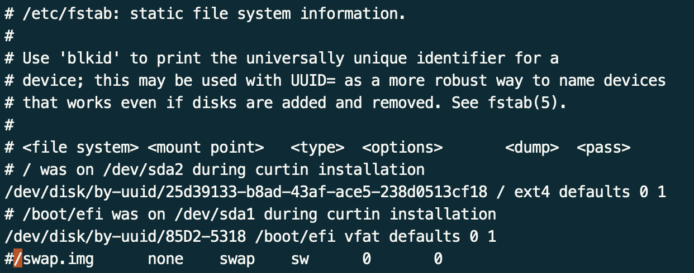
    
- Confirm no swap memory is allocated
    ```sh
    free -m
    ```
    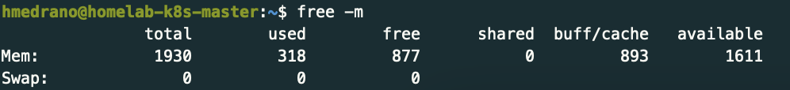

## Install Containerd on each Controller plane and worker node

Official documentation: [Container Runtimes](https://kubernetes.io/docs/setup/production-environment/container-runtimes/)

- Install containerd on each controller and worker node. You don't need to use docker anymore. You don't need to install it on the load balancer!
    
- Configure the continerd service using the default values
    ```sh
    sudo nala install containerd -y
    sudo systemctl status containerd
    sudo mkdir /etc/containerd
    containerd config default | sudo tee /etc/containerd/config.toml
    ```

- Add an additional option
    ```sh
    sudo vi /etc/containerd/config.toml
    #look for runc.options, and change SystemdCgroup = true
    ```
    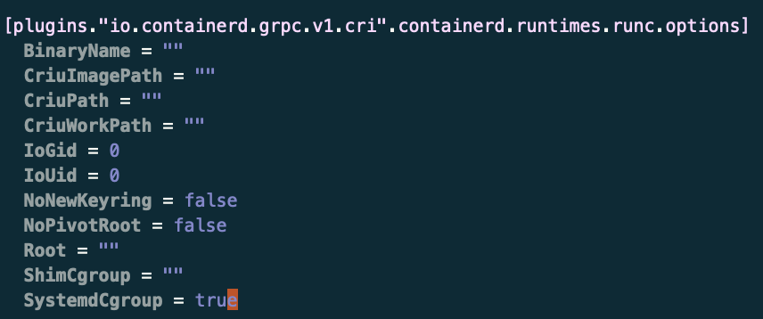
    
- Restart containerd and check the version it's running
    ```sh
    sudo systemctl restart containerd
    sudo systemctl status containerd
    containerd --version
    ```
    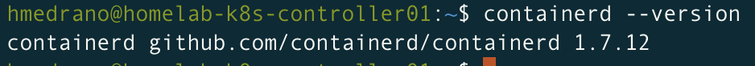

## Install kubeadm, kubelet and kubectl on Controller plane and worker node

Official documentation: [Installing kubeadm, kubelet and kubectl](https://kubernetes.io/docs/setup/production-environment/tools/kubeadm/install-kubeadm/#installing-kubeadm-kubelet-and-kubectl)

- Add the gpg key for downloading and installing Kubernetes repository 

    > If the directory `/etc/apt/keyrings` does not exist, it should be created before the curl command, read the note below. Required for distros older than Debian 12.
sudo mkdir -p -m 755 /etc/apt/keyrings
    
    ```sh
    curl -fsSL https://pkgs.k8s.io/core:/stable:/v1.32/deb/Release.key | sudo gpg --dearmor -o /etc/apt/keyrings/kubernetes-apt-keyring.gpg
    ```

- Add the appropriate Kubernetes apt repository. This overwrites any existing configuration in /etc/apt/sources.list.d/kubernetes.list
    ```sh
    echo 'deb [signed-by=/etc/apt/keyrings/kubernetes-apt-keyring.gpg] https://pkgs.k8s.io/core:/stable:/v1.32/deb/ /' | sudo tee /etc/apt/sources.list.d/kubernetes.list
    ```

- Update the apt package index, install kubelet, kubeadm and kubectl. The last command is used to mark the listed packages so that they are not automatically upgraded when you perform a general system upgrade.
    ```sh
    sudo nala update
    sudo nala upgrade
    sudo nala install kubelet kubeadm kubectl -y
    sudo apt-mark hold kubelet kubeadm kubectl
    ```
    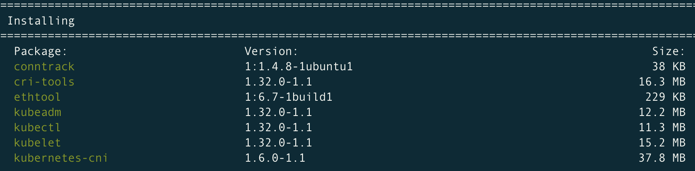
    
- Enable the kubelet service before running kubeadm:
    ```sh
    sudo systemctl enable --now kubelet
    sudo systemctl status kubelet
    ```
    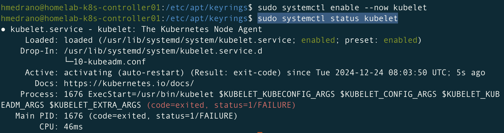

- Confirm the kubectl version
    ```sh
    kubectl version
    ```
    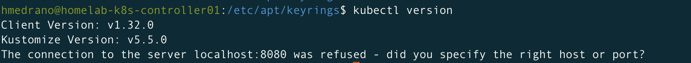

## Creating the Kubernetes Cluster

Official documentation: [Creating a cluster with kubeadm](https://kubernetes.io/docs/setup/production-environment/tools/kubeadm/create-cluster-kubeadm/)

Youtube video: [Kubernetes Multi Master Setup with LoadBalancer on Ubuntu](https://www.youtube.com/watch?v=Zxozz8P_l5M)

### 1. Set up Kubernetes Frontend Load Balancer

- Install HAProxy on the Load Balancer Server
    ```sh  
    sudo nala install haproxy -y
    ```

- Configure HA Proxy. Add the following lines at the end of '/etc/haproxy/haproxy.cfg'.
    ```sh
    frontend kubernetes
        bind 192.168.86.29:6443
        option tcplog
        mode tcp
        default_backend kubernetes-controlplane-nodes
    backend kubernetes-controlplane-nodes
        mode tcp
        balance roundrobin
        option tcp-check
        server homelab-k8s-controller01 192.168.86.21:6443 check fall 3 rise 2
        server homelab-k8s-controller02 192.168.86.22:6443 check fall 3 rise 2
    ```

- Restart the service and make sure it's enabled. The haproxy will fail to connect to the controller nodes, until their kubelet service is up and running.
    ```sh
    sudo systemctl enable haproxy
    sudo systemctl restart haproxy
    sudo systemctl status haproxy
    ```
    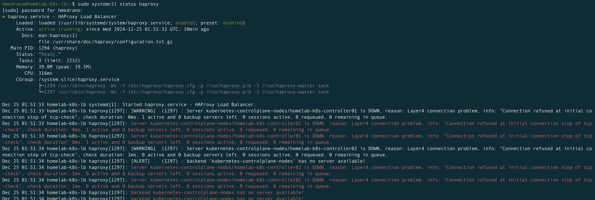

### 2. Set up the first controller plane node 

- Initialise your first controller plane node. Run this command only in the first controller node.

    > Note: We'll use the default Pod Network (Cluster CIDR): 10.244.0.0/16
    
    ```sh
    # sudo kubeadm init --control-plane-endpoint=<load-balancer_ip_address>:6443 --upload-certs --apiserver-advertise-address=<controller01_ip_address> --pod-network-cidr=10.244.0.0/16

    sudo kubeadm init --control-plane-endpoint=192.168.86.29:6443 --upload-certs --apiserver-advertise-address=192.168.86.21 --pod-network-cidr=10.244.0.0/16
    ```

- Save the confirmation of the control-plane node. Keep it privately.
    
    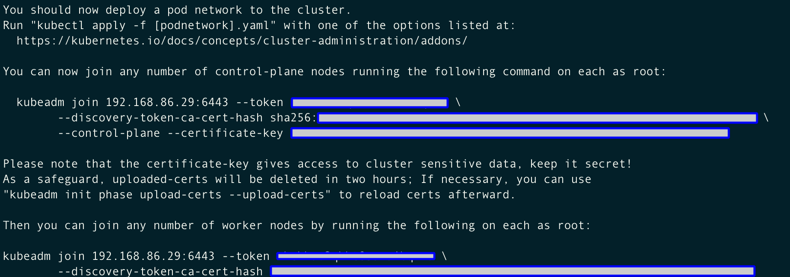

- Give access to manage the cluster to a local user. Run the commands given as an output as a regular user:
    ```sh
    mkdir -p $HOME/.kube
    sudo cp -i /etc/kubernetes/admin.conf $HOME/.kube/config
    sudo chown $(id -u):$(id -g) $HOME/.kube/config
    ```

- Confirm your user can get run the kubectl command. *8Coredns pods are not able to run before a network is installed.**
    ```sh    
    kubectl get pods -A
    ```
    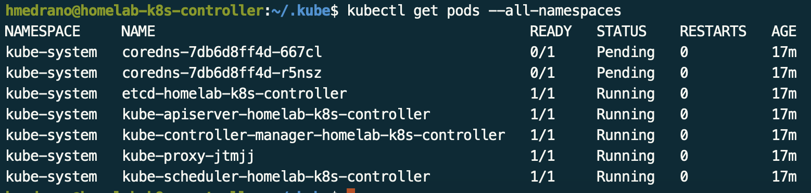

- Confirm the list of the nodes. **Kubelet is not ready because Container runtime network is not installed yet.**

    ```sh
    kubectl get nodes
    ```
    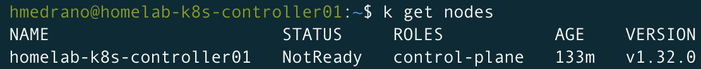

    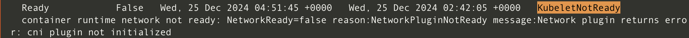

    > Note: 
    >
    > You must deploy a Container Network Interface (CNI) based Pod network add-on so that your Pods can communicate with each other. Cluster DNS (CoreDNS) will not start up before a network is installed.
    >
    > Official documentation: [Network Plugins](https://kubernetes.io/docs/concepts/extend-kubernetes/compute-storage-net/network-plugins/)

### 3. Set up the second controller plane node

- Initialise your second controller plane node. Run this command only in the second controller node
    
    ```sh
    sudo kubeadm join <load-balancer_ip_address>:6443 --token <token generated> \
         --discovery-token-ca-cert-hash
         sha256:<sha_key> \
         --control-plane --certificate-key <certificate_key>
    ```
    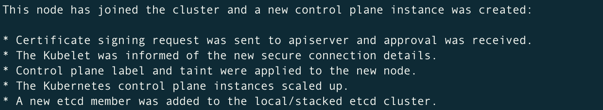

- Give access to manage the cluster to a local user. Run the commands given as an output as a regular user:
    ```sh
    mkdir -p $HOME/.kube
    sudo cp -i /etc/kubernetes/admin.conf $HOME/.kube/config
    sudo chown $(id -u):$(id -g) $HOME/.kube/config
    ```
    
- Check the second controlle plane node has joined and it's ready.
    ```sh    
    k get nodes
    ```
    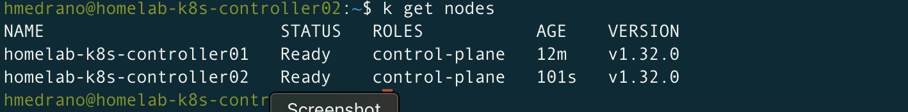
    
- Check all the pods are running on the controler-plane02 node (duplicated amount of pods)
    ```sh    
    kubectl get pods -A
    ```
    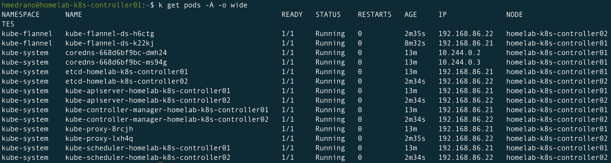

### 4. Join all the worker nodes

- On each worker node, run the command previously given:
    ```sh    
    sudo kubeadm join <load-balancer_ip_address>:6443 --token <token_generated> \
        --discovery-token-ca-cert-hash sha256:<sha_key>
    ```
    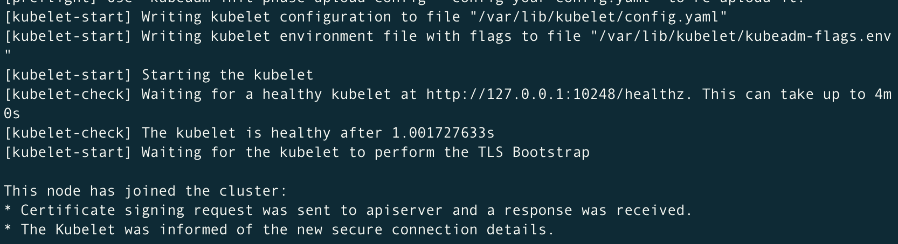

- Run the following command on one of the control plane nodes to make sure the worker node has joined.
    ```sh
    kubectl get node
    ```
    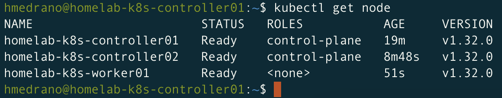

### 5. Create the overlaying network (Pod network add-on)
Official documentation: [Installing Addons](https://kubernetes.io/docs/concepts/cluster-administration/addons/#networking-and-network-policy)

- Make sure that your Pod network does not overlap with any of the host networks. 

    We'll chose **Calico Operator**, as it can manage a network policy: [Install Calico networking and network policy for on-premises deployments](https://docs.tigera.io/calico/latest/getting-started/kubernetes/self-managed-onprem/onpremises#install-calico)

- Install the operator on your cluster.
    ```sh
    kubectl create -f https://raw.githubusercontent.com/projectcalico/calico/v3.29.1/manifests/tigera-operator.yaml
    watch kubectl get nodes
    ```

- Download the custom resources necessary to configure Calico. If you wish to customize the Calico install, customize the downloaded custom-resources.yaml manifest locally.

    > Note: We'll use the default settings:
    >
    > Pod Network (Cluster CIDR): 10.244.0.0/16
    >
    > Service Network (Service CIDR): 10.96.0.0/12

    ```sh
    curl https://raw.githubusercontent.com/projectcalico/calico/v3.29.1/manifests/custom-resources.yaml -O
    code custom-resources.yaml
    ```

- Modify the [custom-resources.yaml](03-custom-resources.yaml). Change the Pod Network (Cluster CIDR) to '10.244.0.0/16'

    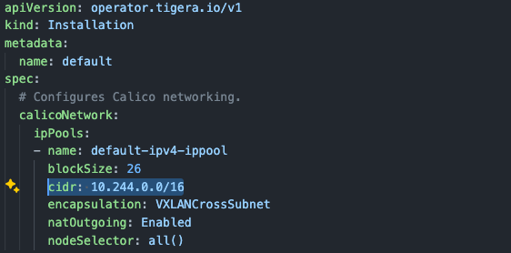

- Create the manifest to install Calico.
    ```sh
    kubectl create -f 03-custom-resources.yaml  
    ```

- Check all the pods are running. **This may take a few minutes**.
    
    ```sh
    kubectl get pods -A
    kubectl get pods -n calico-system
    ```
    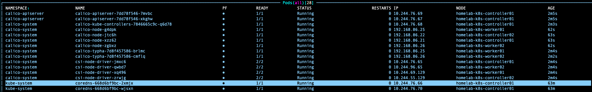

- Check the nodes are running
    ```sh
    k get nodes
    ```
    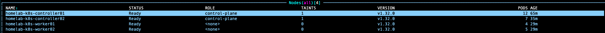

- [Optional] [Install calicoctl](https://docs.tigera.io/calico/latest/operations/calicoctl/install)

    ```sh
    cd ~/Downloads
    curl -L https://github.com/projectcalico/calico/releases/latest/download/calicoctl-darwin-amd64 -o calicoctl
    chmod +x calicoctl && sudo mv calicoctl /usr/local/bin/
    ```

### 6. Verification

- Create a busybox pod. It should run on either worker node.
    ```sh
    kubectl run busybox -n default --image=busybox:1.28 --restart Never --command -- sleep 180
    ```
    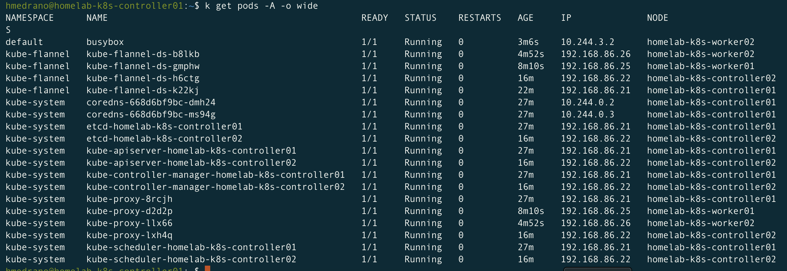

    ```sh
    kubectl exec -ti -n default busybox -- nslookup kubernetes
    ```
    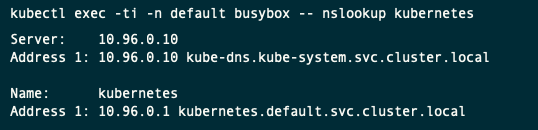