# Proxmox

## Installing Proxmox

### Install using a USB Flash Drive

- Download the latest version of the Proxmox VE ISO Installer: [Proxmox: Downloads](https://www.proxmox.com/en/downloads).

- Flash a USB drive using a software such as [Balena Etcher](https://etcher.balena.io/)

- Connect the USB drive in the the machine/server, power it up and enter in the BIOS to make sure it will boot using the USB.

- Select the option with Graphical interface

    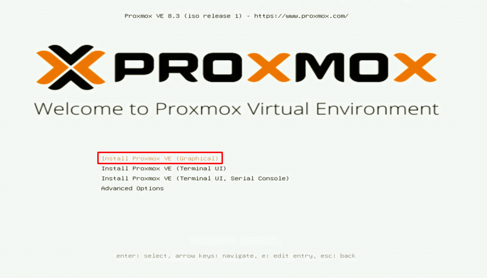

- Adjust the fixed IP address and finish the set up.

- Using your browser, open the IP assigned, followed by the port 8006 [https://<proxmox_ip_address>:8006](https://<proxmox_ip_address>:8006).

### Upgrade Proxmox

#### Versions 9.x

- Find out the version of your Proxmox server

  ```sh
  pveversion -v
  ```

- Update Repository Sources. Change from Bookworm (PVE 8) to Trixie (PVE 9):

  ```sh
  nano /etc/apt/sources.list
  # Old (comment out or remove):
  # deb http://ftp.debian.org/debian bookworm main contrib
  # deb http://ftp.debian.org/debian bookworm-updates main contrib
  # deb http://security.debian.org/debian-security bookworm-security main contrib

  # New:
  deb http://ftp.debian.org/debian trixie main contrib
  deb http://ftp.debian.org/debian trixie-updates main contrib
  deb http://security.debian.org/debian-security trixie-security main contrib
  ```

- Update Proxmox Repository. For no-subscription repository.

  ```sh
  nano /etc/apt/sources.list.d/pve-no-subscription.list

  # New:
  deb http://download.proxmox.com/debian/pve trixie pve-no-subscription
  ```

- Perform the Upgrade

  ```sh
  # Update package lists
  apt update

  # Check for held packages
  apt-mark showhold

  # Start the upgrade
  apt dist-upgrade
  ```

- Handle Configuration Questions. During upgrade, you'll be prompted about configuration files. Generally:

  - Keep your current configuration for network interfaces
  - Accept new configurations for system files unless you have specific customizations

- Reboot

  ```sh
  reboot
  ```

- Post-installation, verify Installation

  ```sh
  pveversion -v
  cat /etc/debian_version  # Should show Trixie/Sid
  ```

- Check Services

  ```sh
  systemctl status pveproxy pvedaemon pve-cluster
  ```

- Update VM/CT Configurations. Some VMs might need configuration updates for new features or compatibility.

- Clean Up
  ```sh
  apt autoremove
  apt autoclean
  ```

#### Versionx 8.x

- Disable the Enterprise Repository.

  ```sh
  vi /etc/apt/sources.list.d/pve-enterprise.list
  # Comment this line
  # deb https://enterprise.proxmox.com/debian/pve bookworm pve-enterprise

  vi /etc/apt/sources.list.d/ceph.list
  # Comment this line
  # deb https://enterprise.proxmox.com/debian/ceph-quincy bookworm enterprise
  ```

- Enable the No-Subscription Repository

  ```sh
  echo "deb http://download.proxmox.com/debian/pve bookworm pve-no-subscription" | tee /etc/apt/sources.list.d/pve-no-subscription.list
  ```

- Find out the version of your Proxmox server

  ```sh
  pveversion -v
  ```

    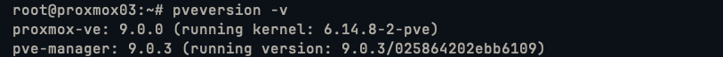

- Run these two commands. This will update all packages to the latest version of that major version.
  ```sh
  apt update
  apt full-upgrade
  ```

### High availability set up with two nodes

YouTube video: [ProxMox High Availability Cluster!](https://www.youtube.com/watch?v=08b9DDJ_yf4)

- Edit the `nano /etc/hosts` and add the name of the other host, on each server.

    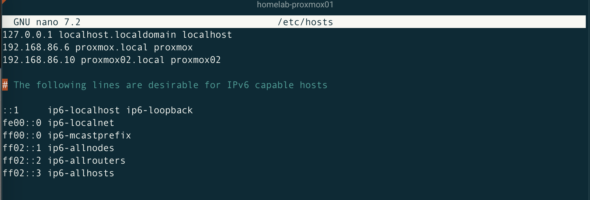

#### On your **First Proxmox node**:

- Go to Datacenter -> Cluster -> Create Cluster.

    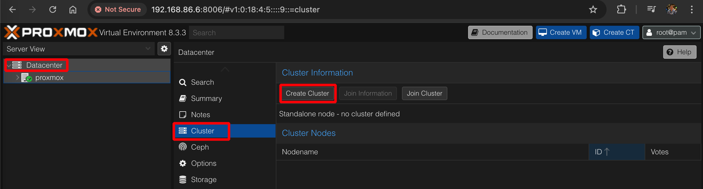

- Enter a name for the new Cluster and the network card to communicate with the second node.

    

- Go to Datacenter -> Cluster -> Select the cluster created -> Join information.

    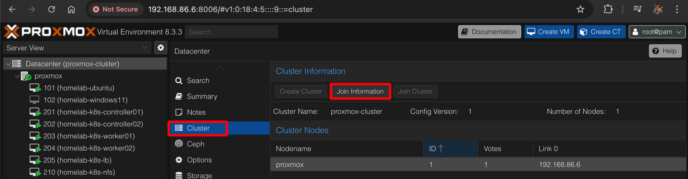

- Copy the information shown.

#### On your **Second Proxmox node**:

- Go to Datacenter -> Cluster -> Join Cluster.

    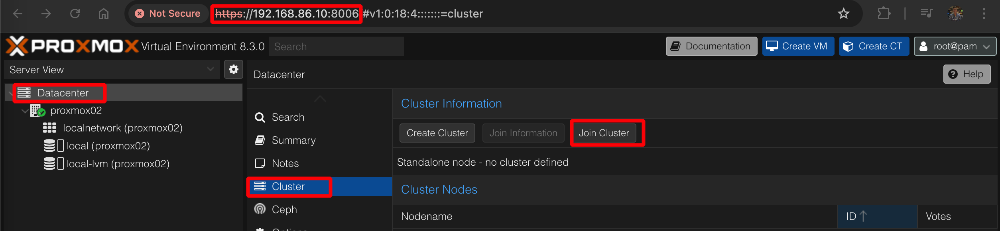

- Paste the Join Information, add the IP address of the first node and enter its password.

    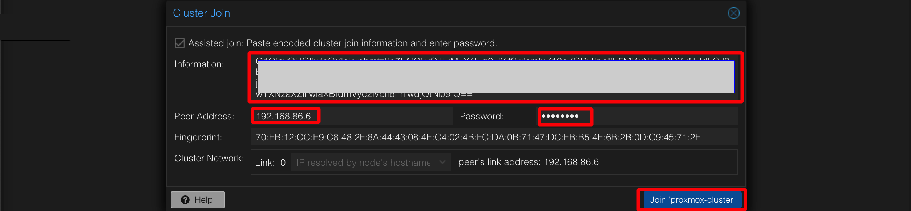

    

- After a few seconds, the two nodes will be shown unther the Cluster.

    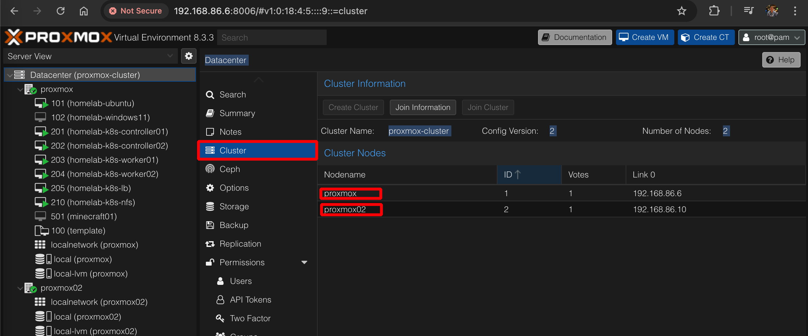

#### Configuring a ZFS Volume

> Note: We are going to configure a CFS mirror to enable high availability in the cluster.
>
> The ZFS pools must have identical names. Otherwise, if a VM is migrated to a new node it won't know what path it needs to follow to access its virtual disk

- Make sure in both nodes its own storage has is configured and healthy. Go to Datacenter -> `<Proxmox_first_node>` -> Disks.

    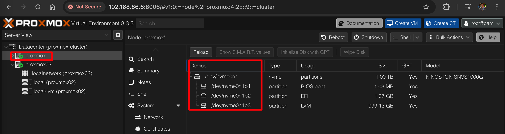

    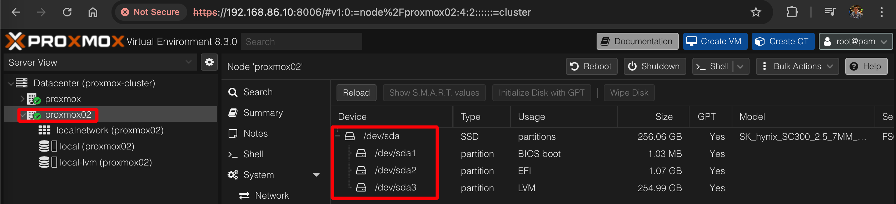

- Go to Datacenter -> `<Proxmox_first_node>` -> Disks -> ZFS -> Create ZFS.

    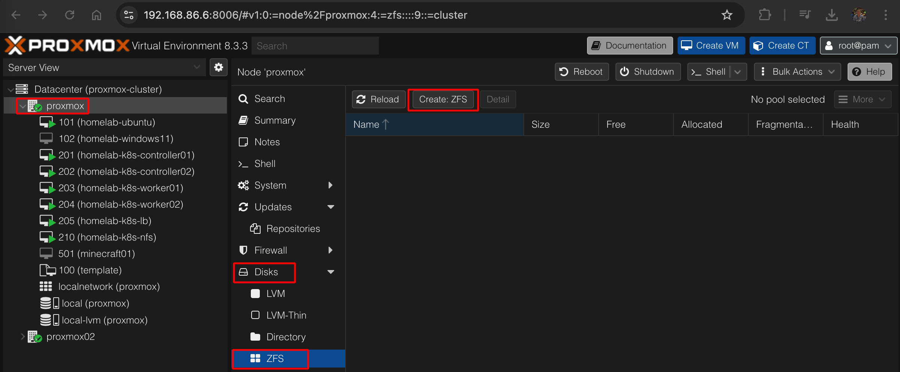

  - `Name: HL-Storage`
  - `RAID Level: Mirror`
  - Make sure the `Add Storage` checkbox is selectec.
  - Select the disks you'd like to add.

WORK IN PROGRESS

HIGH AVAILABILITY REQUIRES THREE NODES

...

...

...

...

...

...

...

## Ubuntu install (Virtual Machine)

### Settings in Proxmox

- OS:

  - Guest OS type: Linux
  - Guest OS Version: 6.x - 2.6 Kernel

- System:

  - Graphic card: Default
  - Machine: q35 (UEFI)
  - BIOS: OVMF (UEFI)
  - EFI Storage: local-lvm

- Disks:

  - Bus/Device: SCSI
  - Storage: local-lvm
  - Disk size: 60 GiB (Thin prevision by default)
  - Cache: Default (No chache)
  - Discard: Disable (default)
  - IO thread: Disable (default)

- CPU:

  - Sockets: 1
  - Cores: 8
  - Types: x86-64-v2-AES (New default)

- Memory:

  - Memory: 16384 MiB
  - Advanced -> Ballooning Device: Check

- Network:

  - Bridge: vmbr0
  - Model: Intel E1000

### Installing Ubuntu

- Install Ubuntu Desktop 24.04 TLS and set IP address udring install
- Enable SSH

  ```sh
  sudo apt update
  sudo apt install nala -y
  sudo nala install openssh-server -y
  sudo systemctl start ssh
  sudo systemctl enable ssh
  sudo systemctl status ssh
  sudo nala install ufw -y
  sudo ufw allow ssh
  sudo ufw enable
  sudo ufw status

  # Then from your laptop
  ssh-copy-id -i homelab.pub hmedrano@192.168.86.7
  ```

- Enable RDP Server
  ```sh
  sudo nala install xrdp -y
  sudo systemctl start xrdp
  sudo systemctl enable xrdp
  sudo systemctl status xrdp
  sudo ufw allow 3389
  sudo ufw enable
  sudo ufw status
  ```
- Upgrade the system

  ```sh
  sudo nala update
  sudo nala upgrade -y
  sudo reboot now
  ```

- Install curl

  ```sh
  sudo nala install curl -y
  ```

- Set up automatic upgrades

  ```sh
  sudo nala install unattended-upgrades
  systemctl status unattended-upgrades
  ```

  ```sh
  sudo vi /etc/apt/apt.conf.d/50unattended-upgrades
  # Remove the comment for the line "${distro_id}:${distro_codename}-updates";
  ```

    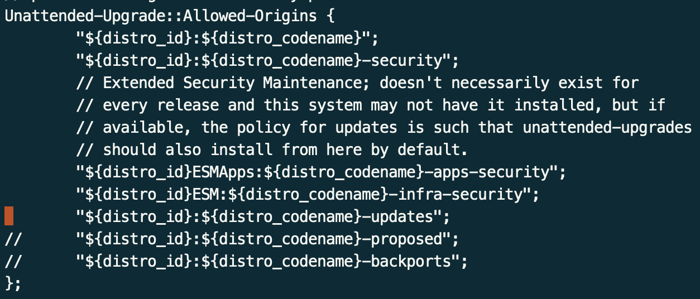

  ```sh
  sudo vi /etc/apt/apt.conf.d/20auto-upgrades
  APT::Periodic::AutocleanInterval "7";
  ```

     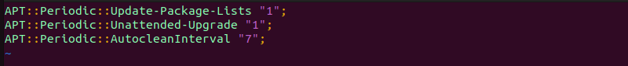

  ```sh
  sudo systemctl restart unattended-upgrades.service
  sudo systemctl status unattended-upgrades.service
  sudo unattended-upgrades --dry-run --debug
  sudo unattended-upgrades
  ```

## Windows 11 install (Virtual Machine)

### Settings in Proxmox

- OS:

  - Guest OS > Type: Microsoft Windows
  - Guest OS > Version: 11/2022/2025
  - Add additional driver for VirtIO: Checked
    - Storage: local
    - ISO image: virtio-win-0.1.240.iso or latest

- System:

  - Graphic card: Default
  - Machine: q35
  - BIOS: OVMF (UEFI)
  - EFI Storage: local-lvm
  - SCSI Controller: VirtIO SCSI single
  - Add EFI Disk:
  - Add TPM: Checked. (Required for Windows 11)

- Disks:

  - Bus/Device: SCSI
  - Storage: local-lvm
  - Disk size: 60 GiB (Thin prevision by default)
  - Cache: Write back
  - Discard: Enabled
  - IO thread: Enabled
  - SSD emulation: Enabled

- CPU:

  - Sockets: 1
  - Cores: 8
  - Types: x86-64-v2-AES (New default)

- Memory:

  - Memory: 16384 MiB
  - Advanced -> Balloning Device: Uncheck (Not recommended , as it will allocate all the memory to the VM)

- Network:
  - Bridge: vmbr0
  - Mode: Intel E1000

### Installing Windows

Official Documentation:

- [How to install Win11 in Proxmox | Quick guide | And fix problems of network search](https://forum.proxmox.com/threads/how-to-install-win11-in-proxmox-quick-guide-and-fix-problems-of-network-search.136596/)

- [How to Install Windows 11 on M1/M2 Mac with VMWARE Fusion 13 (NEW)](https://www.youtube.com/watch?v=srOty2jflF4)

Download the ISO: - [x86](https://www.microsoft.com/en-us/software-download/windowsinsiderpreviewiso) - [ARM](https://www.microsoft.com/en-us/software-download/windowsinsiderpreviewarm64)

Download Virtio-win ISO: [virtio-win.iso](https://fedorapeople.org/groups/virt/virtio-win/direct-downloads/stable-virtio/virtio-win.iso)

#### Windows Inside program

- Install the Vmware tools / mount the drive

- Upgrade the driver for the network adapter

- Settings -> Windows insider program - > Link an account

- Set-ExecutionPolicy RemoteSigned

#### Enable RDP on Windows 11 Hack

[https://www.youtube.com/watch?v=QWeQk-8HwFo](How To Fix Rdp Not Working On Windows 11 Home)

    > Note: [How to Install Windows 11 on M1/M2 Mac with VMWARE Fusion 13 (NEW)](https://www.microsoft.com/en-us/software-download/windowsinsiderpreviewiso)

## Cheat sheet

- List all VMs

  `qm list`

- List all LVM-based VM disks.

  `lvs | grep vm-`

## References:

> Note:
>
> These are just some notes I've collected. Not a full description on how to install Proxmox.

Offical documentation:

- [Proxmox: High Availability](https://pve.proxmox.com/wiki/High_Availability)

YoutTube Videos:

- [Let's Install Proxmox 8.0!: Linux ](https://www.youtube.com/watch?v=sZcOlW-DwrU)

- [Don’t run Proxmox without these settings!](https://www.youtube.com/watch?v=VAJWUZ3sTSI)

- [ProxMox High Availability Cluster!](https://www.youtube.com/watch?v=08b9DDJ_yf4)

- [Windows 11 on Proxmox -- Virtualization made easy](https://www.youtube.com/watch?v=iq3F5wgn_CI)
