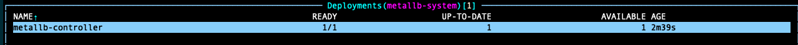

# Deploying a MetalLB Load Balancer in Kubernetes

Official Documentation: [MetalLB Installation](https://metallb.io/installation/#installation-with-helm)

YouTube: [[07] Deploying a Load Balancer to a Kubernetes Cluster](https://www.youtube.com/watch?v=-70LOie9ZGg&list=PLVBNl4E-lnBJR9UwFd5w05ama_4IkV-8I&index=8)

## Introduction

MetalLB provides a network load-balancer implementation for a bare-metal deployments. This service provides address allocation, and external announcement.

- **Address allocation:** MetalLB allocates an IP address to your Kubernetes cluster's services out of a pools of IPs assigned.

  - Your hosting provider probably offers IP addresses for lease, and you can assign that to MetalLB.

  - Alternatively, your cluster might be purely private (RFC1918 addresses).

  - Or you can do both.

- **External announcement:** MetalLB needs to make the network beyond the cluster aware that the IP “lives” in the cluster. Three modes are used: ARP, NDP, or BGP.

  - Layer 2 mode (ARP/NDP): One machine in the cluster takes ownership of the service, and uses standard address discovery protocols (ARP for IPv4, NDP for IPv6) to make those IPs reachable on the local network. Using BGP allows for *true load balancing* across multiple nodes. [MetalLB in Layer 2 mode](https://metallb.universe.tf/concepts/layer2/).

  - BGP: All machines in the cluster establish BGP peering sessions with nearby routers that you control, and tell those routers how to forward traffic to the service IPs. [MEtalLB in BGP mode](https://metallb.universe.tf/concepts/bgp/).

## Prerequisites
- A running Kubernetes cluster
- `kubectl` command-line tool configured to communicate with your cluster
- `helm` command-line tool installed on your local machine

## Conectivity Master and Worker Nodes

Port	          | Protocol	| Component                 |Purpose
----------------|-----------|---------------------------|---------------------------------------------------------------------------------------|
7946 & 7472	    | TCP   	  | Metallb (Speaker)	        | MetalLB uses a gossip protocol that requires the speaker pods to communicate          |
7473		        | TCP       | Metallb (FRR-metrics)	    |                                                                                       |
2605            | TCP       | Metallb (BGPD)            |                                                                                       |
2601            | TCP       | Metallb (Zebra)           |                                                                                       |
2616            | TCP       | Metallb (Staticd)         |                                                                                       |
2617            | TCP       | Metallb (BFDD)            |                                                                                       |
            
## Prepare your kube-proxy in IPVS mode

If you’re using kube-proxy in IPVS mode, since Kubernetes v1.14.2 you have to enable strict ARP mode.

  `kubectl edit configmap -n kube-system kube-proxy`

- Look for `ipvs:`, and then `strictARP`. Change the value from `false` to `true`. Then, save and exit the configmap.

  

- Look for `mode`, and set it up to `ipvs`.

  

## Prepare a namespace for MetalLB

> ⚠️ **Warning**: The speaker pod requires elevated permission in order to perform its network functionalities.
> 
> If you are using MetalLB with a kubernetes version that enforces pod security admission (which is beta in k8s 1.23), the namespace MetalLB is deployed to must be labelled with:

- Create a new namespace called matallb, using this file [01-metallb-namespace.yaml](01-metallb-namespace.yaml). 
  This file includes the pod security labels suggested by the official documentation.

  ```sh
  kubectl apply -f 01-metallb-namespace.yaml
  kubectl get ns
  ```

  

## Download the metallb/metallb Helm repository and modify the configuration

- From your laptop with access the the Kubernetes Cluster, add the MetalLB repository and update it.

  ```sh
  helm repo add metallb https://metallb.github.io/metallb
  helm repo update
  ```
  

- Search for all the charts for the installed repository. You should find one called **metallb/metallb**

  ```sh
  helm search repo metallb
  ```
  
  

- Download the values file to configure the helm chart.
    ```sh
    cd ~/Documents/MyHomelab-k8s/02-METALLB/
    helm show values metallb/metallb > 02-metallb-values.yaml
    ```

- Then open this file in a editor, such as vim or Visual Studio code, and modify the configuration.

- Modify **loadBalancerClass**

  - loadBalancerClass: (A name for your class, such as metallb)

  

- Modify the **controller** configuration.

  - webhookMode: enabled
  
  

  - serviceAccount > name: (A name for your controller's service account, such as metallb-controller-manager)

  

- Modify the **speaker** configuration.

  - serviceAccount > name: (A name for your speaker's service account, such as metallb-speaker-manager)

  


## Install the MetalLB Helm chart

- Deploy MetalLB helm chart, using this file [02-metallb-values.yaml](02-metallb-values.yaml)

  ```sh
  helm install metallb metallb/metallb -n metallb-system -f 02-metallb-values.yaml
  watch kubectl get all -n metallb-system
  ```
  

  If the installation fails, use this command to uninstall the helm, make sure all the resources have been removed and try again.

  ```sh
  helm uninstall metallb -n metallb-system
  watch kubectl get all -n metallb-system
  ```

- Confirm a speaker pod is running on each **controller/worker node* and one controller pod have been created in one of the worker nodes.

  
  
  

- Check the logs of the pods and confirm everything is working. MetalLB uses a gossip protocol that requires the speaker pods to communicate over TCP port 7946. Is you see the error below, you'll need to allow connectivity between the pods.

  

- Confirm two speaker pods logs are correct now

  

## Verification: Create an IP Address Pool
Official documentation: [MetalLB Configuration](https://metallb.io/configuration/)

The installation manifest does not include a configuration file. MetalLB’s components will still start, but will remain idle until you start deploying resources. 

- Make sure your DHCP server on your network excludes the IP Address pool defined for MetalLB.

  

- Create a new definition file for the IPs to assign to the Load Balancer Services [03-IPAddressPool.yaml](03-IPAddressPool.yaml).

- Create the IP Address Pool. Controlling automatic address allocation.

  ```sh
  kubectl create -f 03-IPAddressPool.yaml 
  kubectl get all -n metallb-system
  kubectl get IPAddressPool -n metallb-system
  ```
  
  

## Verification: Layer 2 mode advertising

https://metallb.io/configuration/_advanced_l2_configuration/

- Let MetalLB to advertise that IP address range using this file [04-L2Advertisement.yaml](04-L2Advertisement.yaml).

  ```sh
  kubectl create -f 04-L2Advertisement.yaml
  ```

## Verification: NGINX deployment

- Deploy NGNIX and a corresponding service using this file [05-NGINX-deployment.yaml](05-NGINX-deployment.yaml).
  
  ```sh
  kubectl apply -f 05-NGINX-deployment.yaml 
  ```
> This should assign an external-ip to the NGINX deployment.
  
  

## Delete NGINX deployment

  ```sh
  kubectl delete -f 05-NGINX-deployment.yaml
  ```