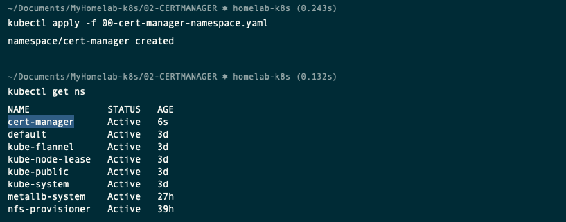

# Deploying a Pebble Certificate Manager in Kubernetes

YouTube Video: [Traefik v2 | Part 3 | Dealing with TLS certificates](https://www.youtube.com/watch?v=7CWc7BLITSQ&list=PL34sAs7_26wNldKrBBY_uagluNKC9cCak&index=3)


## Introduction

Traefix cloud deployment can automatically handle the TLS certificate for you. 

However, when Traefik Ingress controller is installed on bare-metal will try to conect Let's Encrypt Server out in the internet to request a certificate. 

Let's encrypt ACME server won't be able to connect back to your Traefik server yo verify your identity. That's done, using either HTTP, TLS or DNS challenge.

So, we'll use pebble, with is a ACME server for testing purposes. 

Pebble will provide a certificate as part of its configmap that will need to be mounted as a volume in the Traefik pod. 


## Download the Pebble Helm Repository and modify the configuration

Github Repository: [pebble-helm-chart](https://github.com/jupyterhub/pebble-helm-chart)

- From your laptop with access the the Kubernetes Cluster, add the pebble repository and update it.

    ```sh
    helm repo add pebble https://jupyterhub.github.io/helm-chart/
    helm repo update
    ```
    

- Search for all the charts for the installed repository. You should find one called **pebble/pebble**
    ```sh
    helm search repo pebble
    ```
    

- Download the values file to configure the helm chart.
    ```sh
    cd ~/Documents/MyHomelab-k8s/03-CERTMANAGER-PEBBLE/
    helm show values pebble/pebble > 01-PEBBLE-values.yaml
    ``` 

- Then open this file in a editor, such as vim or Visual Studio code, and modify the following entries in the configuration.

    - `env.name: PEBBLE_VA_ALWAYS_VALID` (Uncomment the two lines and set the value to 1. This will bypass the ACME authentication)

        

    - `coredns.enabled: false` (Disable CoreDNS configuration)

        


## Install the Pebble Helm chart

> Note: Pebble will have to be deployed in the same space as Traefik

- If you haven't already, create a new namespace called cert-manager, using this file [00-traefik-namespace.yaml](00-traefik-namespace.yaml).

    ```sh
    kubectl apply -f 00-traefik-namespace.yaml
    kubectl get ns
    ```
    

- Deploy the Pebble helm chart, using this file [01-pebble-values.yaml](01-pebble-values.yaml)

    ```sh
    helm install pebble pebble/pebble --namespace traefik -f 01-pebble-values.yaml
    watch kubectl get all -n traefik
    ```

    

    

- Confirm the Pebble deployment has created a configmap , which it contains the location of the certificate. 
    ```sh
    kubectl describe cm pebble -n traefik
    ```
    
