# Deploying an Ingress Controller using NGINX in Kubernetes

Official documentation: [NGINX Ingress controller](https://docs.nginx.com/nginx-ingress-controller/overview/about/)

YouTube video: [[08] Installing the nginx ingress controller into my kubernetes cluster](https://www.youtube.com/watch?v=i6yb03K9ggU&list=PLVBNl4E-lnBJR9UwFd5w05ama_4IkV-8I&index=9)

## Introduction
This tutorial will guide you through the process of setting up an Ingress Controller in a Kubernetes cluster. An Ingress Controller is responsible for managing access to your services from outside the Kubernetes cluster.

There are several Ingress Controllers available. In this tutorial, we will use NGINX Ingress Controller.

## Prerequisites
- A running Kubernetes cluster
- `kubectl` and `helm` command-line tool configured to communicate with your cluster
- `helm` command-line tool installed on your local machine

## Download the nginx/ingress-nginx Helm repository and modify the configuration

- From your laptop with access the the Kubernetes Cluster, add the nginx repository and update it.

    ```sh
    helm repo add nginx https://kubernetes.github.io/ingress-nginx
    helm repo update
    ```
    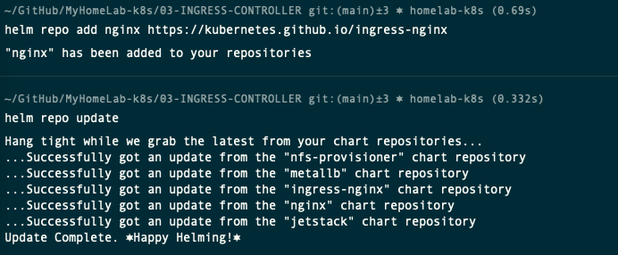

- Search for all the charts for the installed repository. You should find one called **nginx/ingress-nginx**

    ```sh
    helm search repo nginx
    ```
    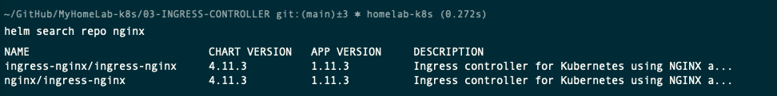

- Download the values file to configure the helm chart.
    ```sh
    cd ~/Documents/MyHomeLab-k8s/03-INGRESS-CONTROLLER-NGINX/
    helm show values nginx/ingress-nginx > 02-nginx-values.yaml
    ```

- Then open this file in a editor, such as vim or Visual Studio code, and modify the following entries in the configuration.

    - `controller > ingressClassResource > default:` true

        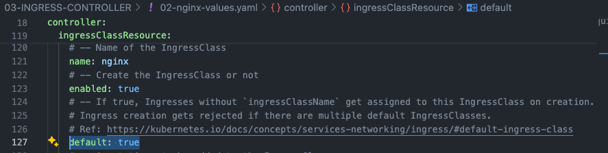
                            
    - `controller > kind:` DaemonSet

        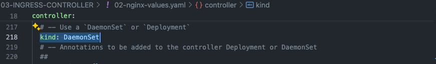

    - `controller > service > loadBalancerClass:` "metallb"

        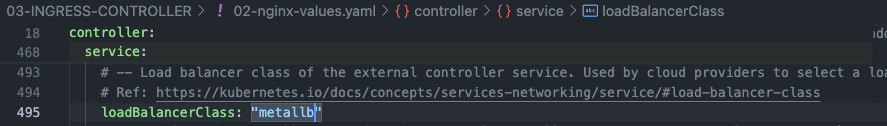

    - `serviceAccount > name:` "nginx-ingress-manager"

        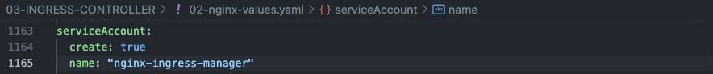

## Install NFS Helm chart

- Create a namespace using this yaml file [01-nginx-namespace.yaml](01-nginx-namespace.yaml)

    ```sh
    k apply -f 01-nginx-namespace.yaml
    k get ns
    ```
    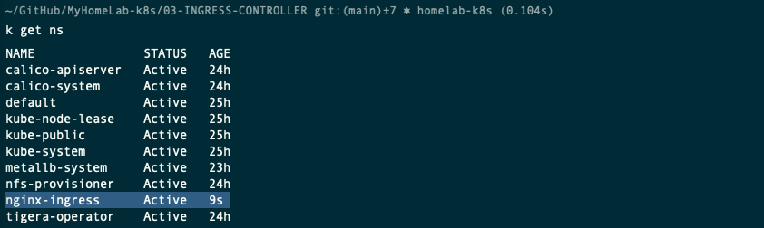

- Deploy nginx-ingress helm chart, using this file [02-nginx-values.yaml](02-nginx-values.yaml).

    > As the LoadBalancer class has been set to MetalLB, the service associated to it should be assigned an external IP address.

    ```sh
    helm install nginx-ingress nginx/ingress-nginx -n nginx-ingress -f 02-nginx-values.yaml
    watch kubectl get all -n nginx-ingress
    ```
    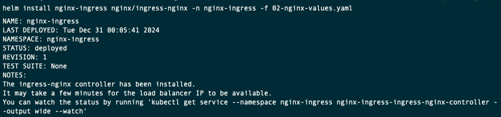

    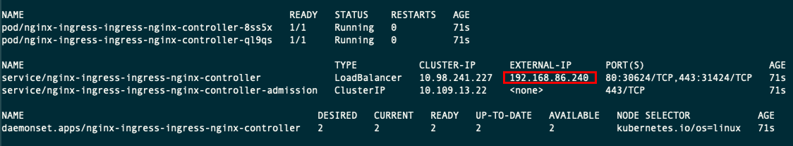

- Confirm a nginx-ingress pod is running on each worker node.

- If the installation fails, use this command to uninstall the helm, make sure all the resources have been removed and try again.

  ```sh
  helm uninstall nginx-ingress -n nginx-ingress
  watch kubectl get all -n nginx-ingress
  ```

## Verify the Installation

- Confirm the nginx server can be reached inside your network. Using the external IP address assigned, open a the URL from your browser. [https://192.168.86.240/](https://192.168.86.240/)

    

## Testing Ingress Resources

This is a great repository of yaml file examples, which we will use templates for out deployment. 

Repository: [justmeandopensource by Venkat Nagappan](https://github.com/justmeandopensource/kubernetes)

- Download the templates:

    ```sh
    curl -O https://raw.githubusercontent.com/justmeandopensource/kubernetes/master/yamls/ingress-demo/nginx-deploy-main.yaml
    curl -O https://raw.githubusercontent.com/justmeandopensource/kubernetes/refs/heads/master/yamls/ingress-demo/nginx-deploy-green.yaml
    curl -O https://raw.githubusercontent.com/justmeandopensource/kubernetes/refs/heads/master/yamls/ingress-demo/nginx-deploy-blue.yaml
    curl -O https://raw.githubusercontent.com/justmeandopensource/kubernetes/refs/heads/master/yamls/ingress-demo/ingress-resource-1.yaml
    curl -O https://raw.githubusercontent.com/justmeandopensource/kubernetes/refs/heads/master/yamls/ingress-demo/ingress-resource-2.yaml
    curl -O https://raw.githubusercontent.com/justmeandopensource/kubernetes/refs/heads/master/yamls/ingress-demo/ingress-resource-3.yaml
    ```

- Deploy nginx-deploy-main.yaml

    ```sh
    kubectl apply -f nginx-deploy-main.yaml
    kubectl apply -f nginx-deploy-green.yaml
    kubectl apply -f nginx-deploy-blue.yaml
    ```

- Expose the deployments on port 80. It creates a service for each deployment.

    ```sh
    kubectl expose deploy nginx-deploy-main --port 80
    kubectl expose deploy nginx-deploy-green --port 80
    kubectl expose deploy nginx-deploy-blue --port 80
    watch kubectl get all
    ```
    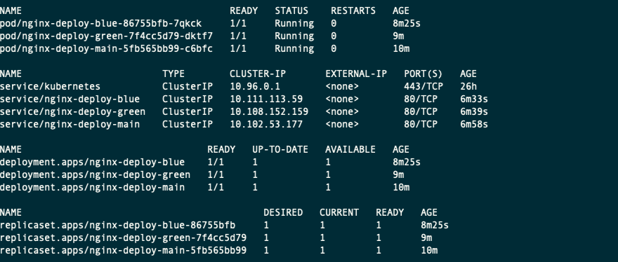

- Deploy the ingress resources

    ```sh
    kubectl apply -f ingress-resource-1.yaml
    kubectl get ingress -A
    ```
    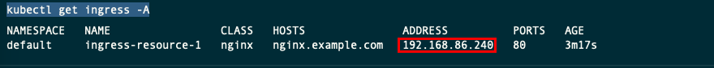


- Modify the `/etc/hosts`. Enter the record based on the ip address provided by the ingress controller.

    ```sh
    sudo vi /etc/hosts
    ```
    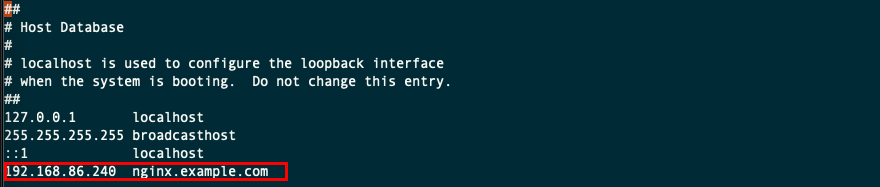


- Confirm the nginx server can be reached inside your network. Using the external IP address assigned, open a the URL from your browser. [https://nginx.example.com/](https://nginx.example.com/)

    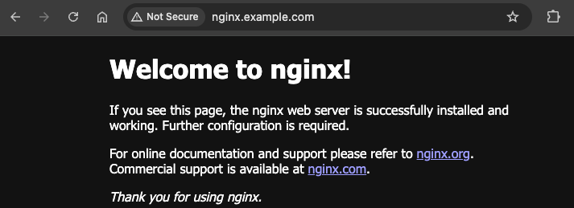

- Delete the last ingress, and deploy ingress3. Then, confirm it's loaded  [https://http://nginx.example.com/blue](https://http://nginx.example.com/blue)

    ```sh
    kubectl delete -f ingress-resource-1.yaml
    kubectl apply -f ingress-resource-3.yaml
    ```
    

## Delete all ingress and deployment and DNS entry

- Delete all ingress and deployment
    ```sh
    kubectl delete -f ingress-resource-3.yaml
    kubectl delete -f nginx-deploy-green.yaml 
    kubectl delete -f nginx-deploy-blue.yaml
    kubectl delete -f nginx-deploy-main.yaml 
    kubectl delete service nginx-deploy-blue
    kubectl delete service nginx-deploy-green
    kubectl delete service nginx-deploy-main
    ```
- Delete the entry in the `/etc/hosts`
