# Deploying a dynamic NFS provisioner

Official documentation: [Deploying NFS Server in Kubernetes](https://github.com/appscode/third-party-tools/blob/master/storage/nfs/README.md)

YoTube video: [[05] Kubernetes - Deploying a dynamic NFS provisioner](https://www.youtube.com/watch?v=04PMf68D1qE&list=PLVBNl4E-lnBJR9UwFd5w05ama_4IkV-8I&index=2)

## Introduction

This document provides a guide to setting up NFS for your Kubernetes homelab environment. Storage provisioners are tools that provision storage resources for containers and applications running in a Kubernetes cluster. 

NFS (Network File System) volumes can be mounted(https://kubernetes.io/docs/concepts/storage/volumes/#nfs) as a PersistentVolume in Kubernetes pods. You can also pre-populate an nfs volume. An nfs volume can be shared between pods. It is particularly helpful when you need some files to be writable between multiple pods.

## Prerequisites

- A running Kubernetes cluster
- `kubectl` command-line tool configured to communicate with your cluster
- Helm installed on your local machine

## Set up the virtual machines in Proxmox
Set one virtual machines. Use a proxmox template. Enable SSH, add the public keys, upgrade the system.

Specs:
- 4 GB of Memory
- 2 vCPU 
- 200 GB of Storage

## Install NFS Server
- Run update and upgrade commands. You may need to reboot the server after that, as it's the first time after OS install.

    ```sh
    sudo apt update
    sudo apt upgrade
    reboot
    ```
- Install nala and then use it to install nfs-kernel-server. I prefer to use nala ;-) 

    ```sh
    sudo apt install nala
    sudo nala install nfs-kernel-server -y
    ```
- Enable the nfs service, start it and make sure it's running.

    ```sh
    systemctl start nfs-server
    systemctl enable nfs-server
    systemctl status nfs-server
    ```

    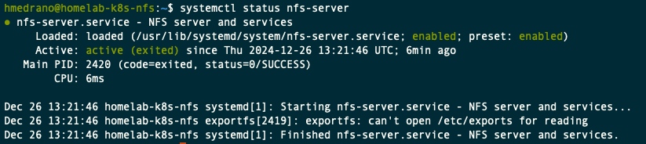

## Configure NFS Exports on the NFS server
Details on how to configure NFS exports for your Kubernetes cluster.

- Create the directory to be shared through NFS. Then, make sure it's owned by the user `nobody`. This is required as containers run Services as different user IDs, and those IDs are being used to transmit the data across the network to your share. If the user ID of the service submitting the data does not align with the user ID who owns the share, your data will be lost.

    ```sh
    sudo mkdir -p /mnt/volume1/kubedata-prod/nfsprov
    sudo chown -R nobody /mnt/volume1/kubedata-prod
    ```

- Add access to this folder by all clients from the network. Subfolder `nfsprov` has been added to separate out additional provisioners which will be install going forward. Consider the security of sharing this folder.

    ```sh
    sudo vi /etc/exports

    # Then add the following line
    /mnt/volume1/kubedata-prod/nfsprov *(rw,sync,no_subtree_check,no_root_squash,no_all_squash,insecure)
    ```
    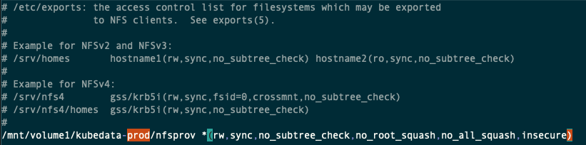

- Export the share, so it becomes visible in your network.

    ```sh
    sudo exportfs -rav
    ```

    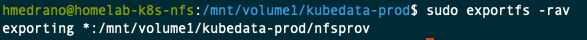

- Confirm the availability of the share.

    ```sh
    sudo showmount -e
    ```

    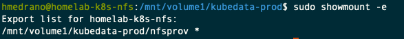

- Finally, you can exit your NFS server

    ```sh
    exit
    ```

## Install NFS package in all Kubernetes master and worker nodes

All worker nodes of our kubernetes cluster need the nfs package installed, otherwise they will not ne able to process NFS mounts. **The following commands will have to be run in every master and worker node.**

- Install the NFS

    ```sh
    sudo nala install nfs-common -y
    ```
    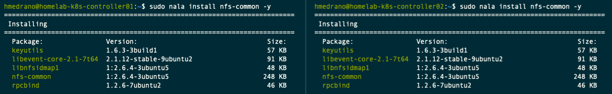

- Test mounting the share in the master nodes to a new folder. The IP address indicated below is the one corresponding to the NFS server. 

    ```sh
    sudo mkdir -p /mnt/testmount
    sudo mount 192.168.86.30:/mnt/volume1/kubedata-prod/nfsprov /mnt/testmount
    sudo mount -l | grep nfs
    ```
    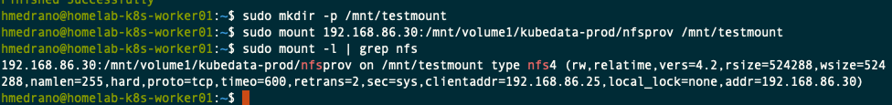

- Then, unmount the test

    ```sh
    sudo umount /mnt/testmount
    ```

## Download the nfs-provisioner/nfs-subdir-external-provisioner Helm repository and modify the configuration

- From your laptop with access the the Kubernetes Cluster, add the NFS repository and update it.

    ```sh
    helm repo add nfs-provisioner https://kubernetes-sigs.github.io/nfs-subdir-external-provisioner/
    helm repo update
    ```
    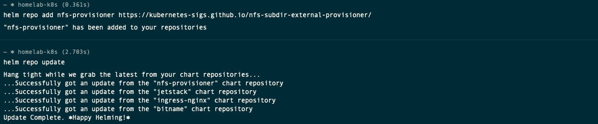

- Search for all the charts for the installed repository. You should find one called *nfs-subdir-external-provisioner*.

    ```sh
    helm search repo nfs-provisioner
    ```
    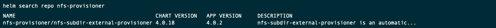

- Download the values file to configure the helm chart.

    ```sh
    cd ~/Documents/MyHomelab-k8s/03-NFS/
    helm show values nfs-provisioner/nfs-subdir-external-provisioner > 01-nfs-prov-values.yaml
    ```

- Then open this file in a editor, such as vim or Visual Studio code.

- Modify the **nfs** configuration.

    - server: (IP address of the NFS Server)

    - path: (Path to the volume defined before) 

    - mountOptions: (Add the nolock option if you are using NextCloud on the external storage)

    - volumeName: (Name of the folder in your file system where the NFS share will be mounted)

    - reclaimPolicy: Retain (The data is still available in case the deployment of pod is deleted)

    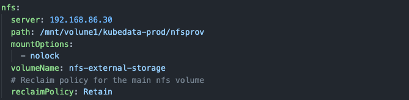

- Modify the **storageClass** configuration.

    - provisionerName: (Set a provisioner name)

    - defaultClass: (Change from false to true)

    - name: (Set a StorageClass name)

    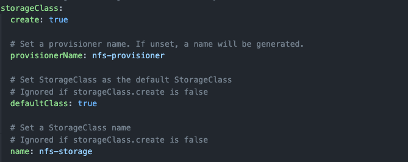

- Modify the **serviceAccount** configuration.

    - name: (The name of the ServiceAccount to use)

    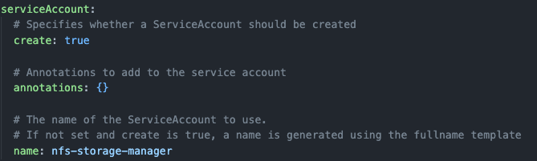

## Install NFS Helm chart

- Create a namespace using this yaml file [01-nfs-namespace.yaml](01-nfs-namespace.yaml)

    `k apply -f 01-nfs-namespace.yaml`

    `k get ns`

    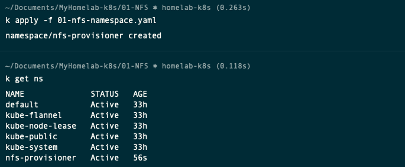

- Deploy NFS provisioner, using this file [02-nfs-prov-values.yaml](02-nfs-prov-values.yaml)

    ```sh
    helm install nfs-provisioner nfs-provisioner/nfs-subdir-external-provisioner -n nfs-provisioner -f 02-nfs-prov-values.yaml
    watch kubectl get all -n nfs-provisioner
    ```

    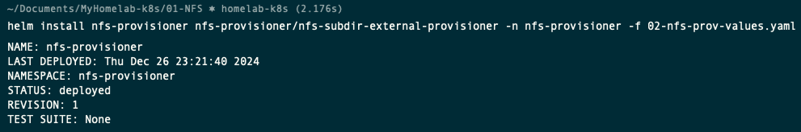

    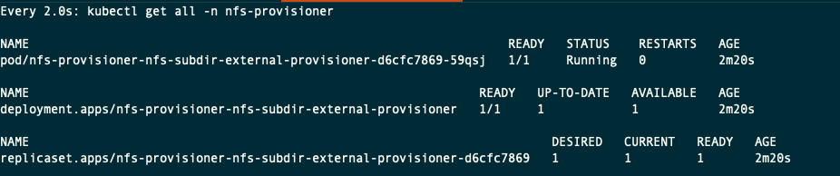

    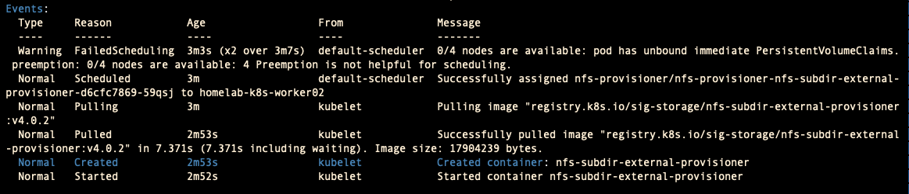

## Test the external storage provisioner works

- Create a persistent volume claim, using this file [03-test-pvc.yaml](03-test-pvc.yaml)

    ```sh
    kubectl apply -f 03-test-pvc.yaml -n default
    ```

    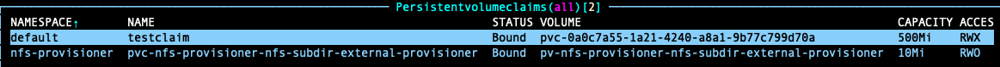

- Create a new pod, make it claim the persisten volume previously created and mount it in the `/mnt` directory.. Use this file [04-test-pod.yaml](04-test-pod.yaml)

    ```sh
    kubectl apply -f 04-test-pod.yaml -n default
    ```

    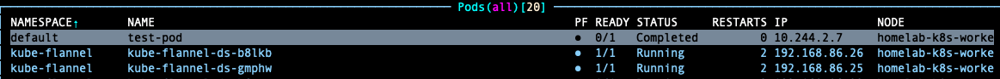

- SSH to your NFS server and make sure the file was created.

    ```sh
    ssh homelab-k8s-nfs
    cd /mnt/volume1/kubedata-prod/nfsprov/
    cd default-testclaim-pvc-<automatically_assigned_ID>
    ls -lht
    ```

    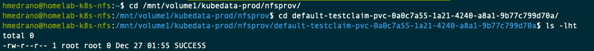

- After that, delete the test-pod and the test-pvc

    ```sh
    kubectl delete -f 04-test-pod.yaml -n default
    kubectl delete -f 03-test-pvc.yaml -n default
    ```

    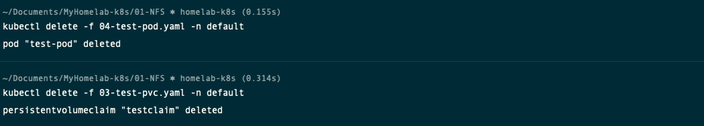

- SSH back to the NFS server and confirm the folder has been marked as archived. You can delete that folder.

    ```sh
    cd /mnt/volume1/kubedata-prod/nfsprov/
    ls -lht
    sudo rm -rf archived-default-testclaim-pvc-0a0c7a55-1a21-4240-a8a1-9b77c799d70a/

    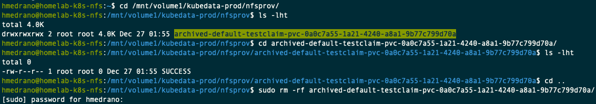