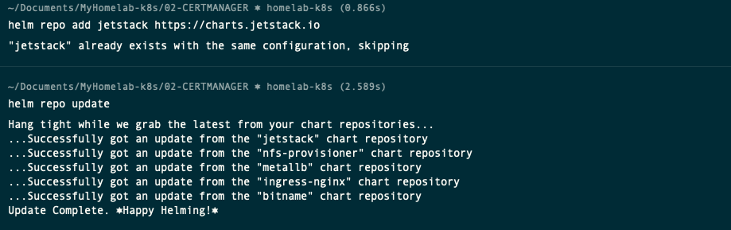
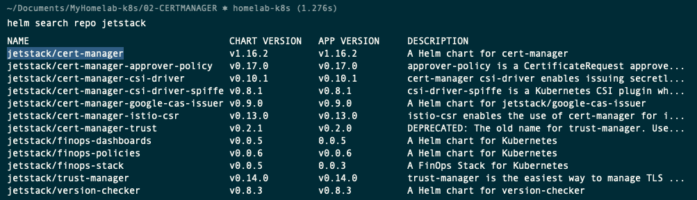
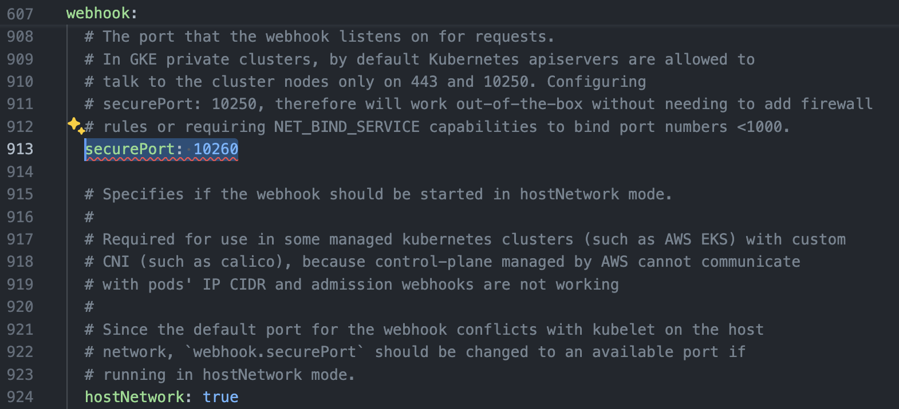
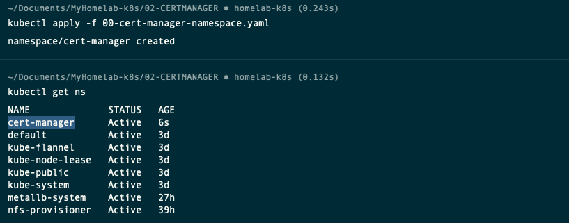
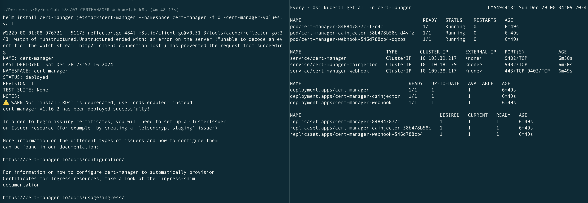
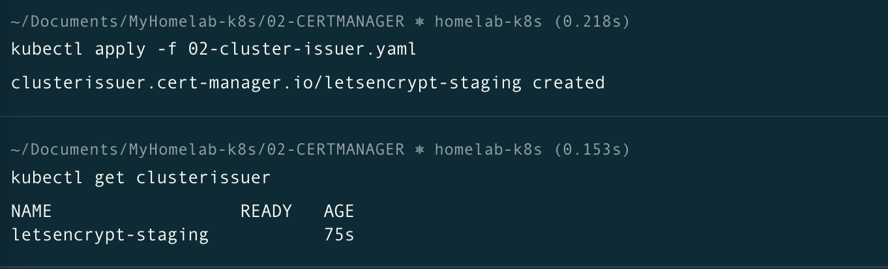
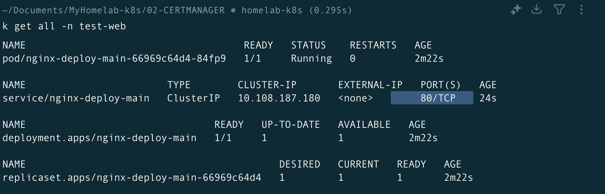
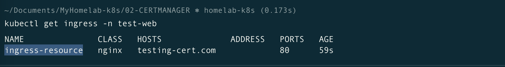

# Deploying a Certificate Manager in Kubernetes

Official Documentation: [Installing cert-managern](https://cert-manager.io/docs/installation/helm/

YouTube: [[09.01] Cert Manager](https://www.youtube.com/watch?v=39bcU68nZms&list=PLVBNl4E-lnBJR9UwFd5w05ama_4IkV-8I&index=10)

## Prerequisites
- A running Kubernetes cluster
- `kubectl` command-line tool configured to interact with your cluster
- Helm installed on your local machine

## Connectivity for Master and Worker nodes
Port	        | Protocol	| Component                 |Purpose
----------------|-----------|---------------------------|---------------------------------------------------------------------------------------|
10260	        | TCP   	| Webhook	                | Webhooks are commonly used for admission control and validation, default port changed |

## Download and modify the Jetstack Helm repository

- From your laptop with access the the Kubernetes Cluster, add the Jetstack repository and update it.

    ```sh
    helm repo add jetstack https://charts.jetstack.io
    helm repo update
    ```

    

- Search for all the charts in this repository installed. You should fine one called **jetstack/cert-manager**

    ```sh
    helm search repo jetstack
    ```

    

- Download the values file to configure the helm chart.

    ```sh
    cd ~/Documents/MyHomelab-k8s/03-CERTMANAGER/
    helm show values jetstack/cert-manager > 01-cert-manager.yaml
    ```
- Then open this file in a editor, such as vim or Visual Studio code, and modify the configuration.

    - installCRDs: true (So, it will install the CRDs for us)

    

    - namespace: cert-manager

    

    - serviceAccount: (No need to change)

    - webhook:
        - securePort: 10260
         - hostNetwork: true

    

> ⚠️ **Warning**: If you are on EKS and you are using a custom CNI such as Weave or Calico, the Kubernetes API server (which is in its own node) might not be able to reach the webhook pod. 
> 
> This happens because the control plane cannot be configured to run on a custom CNI on EKS, meaning that the CNIs cannot enable connectivity between the API server and the pods running in the worker nodes.
>
> By setting securePort to 10260 instead of relying on the default value (which is 10250), you will prevent a conflict between the webhook and the kubelet. 
>
> [The Definitive Debugging Guide for the cert-manager Webhook Pod](https://cert-manager.io/docs/troubleshooting/webhook/#cause-2-eks-on-a-custom-cni)


## Install the Certificate Manager Helm chart

- Create a new namespace called cert-manager, suing this file [00-cert-manager-namespace.yaml](00-cert-manager-namespace.yaml).

    ```sh
    kubectl apply -f 00-cert-manager-namespace.yaml
    kubectl get ns
    ```

    

- Set the current Kubernetes context to use the metallb-system namespace by default. So, it doesn't need to be included everytime we run a command.

    ```sh
    kubectl config set-context --current --namespace=cert-manager
    ```

- Deploy the certificate Manager helm chart, using this file [01-cert-manager-values.yaml](01-cert-manager-values.yaml)

    ```sh
    helm install cert-manager jetstack/cert-manager --namespace cert-manager -f 01-cert-manager-values.yaml 
    watch kubectl get all -n cert-manager
    ```
    

    If the installation fails, use this command to uninstall the helm, make sure all the resources have been removed and try again.

    ```sh
    helm uninstall cert-manager -n cert-manager
    watch kubectl get all -n cert-manager
    ```

## Testing the certificate manager without TLS encrypted connection

An Issuer is a namespaced resource, and it is not possible to issue certificates from an Issuer in a different namespace. This means you will need to create an Issuer in each namespace you wish to obtain Certificates in.

If you want to create a single Issuer that can be consumed in multiple namespaces, you should consider creating a ClusterIssuer resource. This is almost identical to the Issuer resource, however is non-namespaced so it can be used to issue Certificates across all namespaces.

- Create a ClusterIssuer, using this file [test1-cluster-issuer.yaml](test1-cluster-issuer.yaml.yaml)

    ```sh
    kubectl apply -f test1-cluster-issuer.yaml 
    kubectl get clusterissuer -n test-web
    ```
    

- Create a new nginx deployment, using this file [test1-deployment.yaml](test1-deployment.yaml)

    ```sh
    kubectl apply -f test1-deployment.yaml
    k get all -n test-web
    ```
- Expose the deployment as a service on port 80.

    ```sh
    kubectl expose deploy nginx-deploy-main -n test-web --port 80
    k get all -n test-web
    ```
    

- Create a new ingress resource using this file [test1-ingress.yaml](test1-ingress.yaml)

    ```sh
    kubectl apply -f test1-ingress.yaml
    kubectl get ingress -n test-web
    ```

    

## Testing the certificate manager with TLS encrypted connection

- Create a new certificate using this file [test2-certificate.yaml](test2-certificate.yaml)

    ```sh
    kubectl apply -f test2-certificate.yaml
    kubectl get certificate -n test-web
    ```

- Create a new ingress resource using this file [test2-ingress.yaml](test2-ingress.yaml)

    ```sh
    kubectl apply -f test2-ingress.yaml
    ```
- Make sure to delete all the test certificates

    ```sh
    kubectl delete -f test2-ingress.yaml
    kubectl delete -f test2-certificate.yaml
    kubectl delete -f test1-ingress.yaml
    kubectl delete -f test1-deployment.yaml
    kubectl delete -f test1-cluster-issuer.yaml
    ```