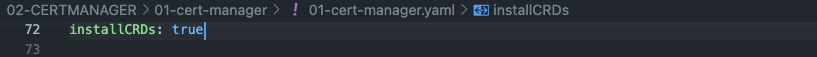
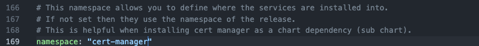
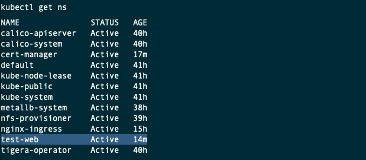
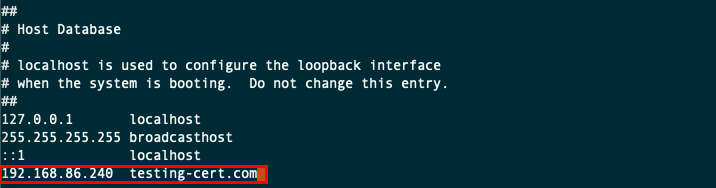
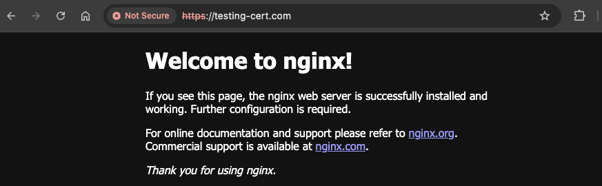
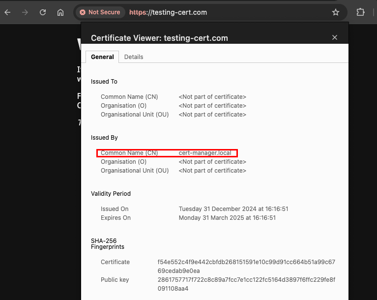

# Deploying a Certificate Manager in Kubernetes

Official Documentation: [Installing cert-managern](https://cert-manager.io/docs/installation/helm/

YouTube: [[09.01] Cert Manager](https://www.youtube.com/watch?v=39bcU68nZms&list=PLVBNl4E-lnBJR9UwFd5w05ama_4IkV-8I&index=10)

## Prerequisites
- A running Kubernetes cluster
- `kubectl` command-line tool configured to interact with your cluster
- `helm` command-line tool installed on your local machine

## Connectivity for Master and Worker nodes
Port	        | Protocol	| Component                 |Purpose
----------------|-----------|---------------------------|---------------------------------------------------------------------------------------|
10260	        | TCP   	| Webhook	                | Webhooks are commonly used for admission control and validation, default port changed |

## Download the jetstack/cert-manager Helm Repository and modify the configuration

- From your laptop with access the the Kubernetes Cluster, add the Jetstack repository and update it.

    ```sh
    helm repo add jetstack https://charts.jetstack.io
    helm repo update
    ```

    

- Search for all the charts for the installed repository. You should find one called **jetstack/cert-manager**

    ```sh
    helm search repo jetstack
    ```

    

- Download the values file to configure the helm chart.

    ```sh
    cd ~/Documents/MyHomelab-k8s/04-CERTMANAGER/
    helm show values jetstack/cert-manager > 01-cert-manager.yaml
    ``` 

- Then open this file in a editor, such as vim or Visual Studio code, and modify the following entries in the configuration.

    - `installCRDs`: true (So, it will install the CRDs for us)

    

    - `namespace:` cert-manager

    

    - `webhook > securePort:` 10260
    - `webhook > hostNetwork:` true

    

> ⚠️ **Warning**: If you are on EKS and you are using a custom CNI such as Weave or Calico, the Kubernetes API server (which is in its own node) might not be able to reach the webhook pod. 
> 
> This happens because the control plane cannot be configured to run on a custom CNI on EKS, meaning that the CNIs cannot enable connectivity between the API server and the pods running in the worker nodes.
>
> By setting securePort to 10260 instead of relying on the default value (which is 10250), you will prevent a conflict between the webhook and the kubelet. 
>
> [The Definitive Debugging Guide for the cert-manager Webhook Pod](https://cert-manager.io/docs/troubleshooting/webhook/#cause-2-eks-on-a-custom-cni)


## Install the Certificate Manager Helm chart

- Create a new namespace called cert-manager, suing this file [00-cert-manager-namespace.yaml](00-cert-manager-namespace.yaml).

    ```sh
    kubectl apply -f 00-cert-manager-namespace.yaml
    kubectl get ns
    ```

    

- Deploy the certificate Manager helm chart, using this file [01-cert-manager-values.yaml](01-cert-manager-values.yaml)

    ```sh
    helm install cert-manager jetstack/cert-manager --namespace cert-manager -f 01-cert-manager-values.yaml 
    watch kubectl get all -n cert-manager
    ```
    

    If the installation fails, use this command to uninstall the helm, make sure all the resources have been removed and try again.

    ```sh
    helm uninstall cert-manager -n cert-manager
    watch kubectl get all -n cert-manager
    ```

## Deploy a Cluster Issuer

An Issuer is a namespaced resource, and it is not possible to issue certificates from an Issuer in a different namespace. This means you will need to create an Issuer in each namespace you wish to obtain Certificates in.

If you want to create a single Issuer that can be consumed in multiple namespaces, you should consider creating a ClusterIssuer resource. This is almost identical to the Issuer resource, however is non-namespaced so it can be used to issue Certificates across all namespaces.

- Create a **ClusterIssuer**, using this file [02-cluster-issuer.yaml](02-cluster-issuer.yaml)

    > You should replace this email address with your own.
    >
    > Let's Encrypt will use this to contact you about expiring certificates, and issues related to your account.

    ```sh
    code 02-cluster-issuer.yaml 
    # Replace the email address with your own.
    kubectl apply -f 02-cluster-issuer.yaml 
    kubectl get clusterissuer -A
    ```
    

## 1. Testing the certificate manager without TLS encrypted connection

- Create a namespace called test-web
    ```sh
    kubectl create ns test-web
    kubectl get ns
    ```
    

- Create a new nginx deployment, using this file [test1-a-deployment.yaml](test1-a-deployment.yaml)

    ```sh
    kubectl apply -f test1-a-deployment.yaml
    watch kubectl get all -n test-web
    ```
- Expose the deployment as a **service** on port 80.

    ```sh
    kubectl expose deploy nginx-deploy-main -n test-web --port 80
    kubectl get svc -n test-web
    ```
    

- Create a new ingress resource using this file [test1-b-ingress.yaml](test1-b-ingress.yamll)

    ```sh
    kubectl apply -f test1-b-ingress.yaml
    kubectl get ingress -A
    ```
    

- Modify the `/etc/hosts`. Enter the record based on the ip address provided by the ingress controller.

    ```sh
    sudo vi /etc/hosts
    ```
    

- Confirm the nginx server can be reached inside your network. Using the external IP address assigned, open this URL from your browser. [https://testing-cert.com/](https://testing-cert.com/)

    > Note: The browser will show the connection is not secure, and not using a signed certificate.

    

- Delete the test ingress, service and deployment

    ```sh
    kubectl delete -f test1-b-ingress.yaml
    ```

## 2. Testing the certificate manager with TLS encrypted connection

- Create a new ingress resource using this file [test2-a-ingress.yaml](test2-a-ingress.yaml).

    > Note: This time, the ingress have a provider issuer, a host name 'testing-cert.com' and it will create a secret named `lets-encrypt-test`.

    ```sh
    kubectl apply -f test2-a-ingress.yaml
    watch kubectl get all -n test-web 
    watch kubectl get secrets -n test-web
    ```
    

- Create a new certificate using this file [test2-b-certificate.yaml](test2-b-certificate.yaml)

    ```sh
    kubectl apply -f test2-b-certificate.yaml
    kubectl get certificate -n test-web
    kubectl get certificaterequest -n test-web
    kubectl get secret -n test-web
    kubectl describe secret lets-encrypt-test -n test-web
    ```

- Refresh the URL from your browser. [https://testing-cert.com/](https://testing-cert.com/)

    > Note: The browser will show the connection is still not secure, but it will show a signed certificate.
    >
    > The certificate request is not responded by Let's encrypt staging, as you need a A record in your domain provider. 

    

- Make sure to delete all the test certificates

    ```sh
    kubectl delete -f test2-b-certificate.yaml
    kubectl delete -f test2-a-ingress.yaml
    kubectl delete svc nginx-deploy-main -n test-web
    kubectl delete -f test1-a-deployment.yaml
    kubectl delete secret lets-encrypt-test -n test-web
    kubectl delete ns test-web
    ```

- Make sure all secrets and services for test-web namespace have been deleted

    ```sh
    kubectl get svc -A
    kubectl get secrets -A
    ```

- Remove the entry in the `/etc/hosts` file