# Deploying an Ingress Controller using Traefik in Kubernetes - Certificates signed by Pebble

Official Documentation: 

- [Traefik: Install using the Helm Chart](https://doc.traefik.io/traefik/getting-started/install-traefik/#use-the-helm-chart)

- [Traefik: Let's Encrypt](https://doc.traefik.io/traefik/https/acme/)

- [Traefik & Kubernetes](https://doc.traefik.io/traefik/providers/kubernetes-ingress/)

YouTube Videos: 
- [How to use Traefik as a Reverse Proxy in Kubernetes? // Ingress Controller Tutorial](https://www.youtube.com/watch?v=n5dpQLqOfqM&t=270s)

- [Kubernetes - On prem install - Load Balancer and Ingress Controller](https://www.youtube.com/watch?v=9iJLw7pUCIk)

- [SSL Certificates Made EASY With Traefik Proxy, Clouflare, and Let's Encrypt - Tutorial](https://www.youtube.com/watch?v=XH9XgiVM_z4)

- [Traefik v2 | Part 3 | Dealing with TLS certificates](https://www.youtube.com/watch?v=7CWc7BLITSQ)


## Prerequisites
- A running Kubernetes cluster 1.2++
- A NFS server with a NFS provisioner chart installed and working.
- Certificate Manager is not required.
- `kubectl` command-line tool configured to interact with your cluster
- `helm` command-line tool installed on your local machine version 3.9+
- The Pebble certificate manager should have been created prior this, under the same namespace (trafik).
- MetalLB Load Balancer installed.

## Download the Traefik Helm Repository, modify the configuration and deploy it

- Confirm the Pebble deployment has created a configmap , which it contains the location of the certificate. 
    ```sh
    kubectl describe cm pebble -n traefik
    ```
    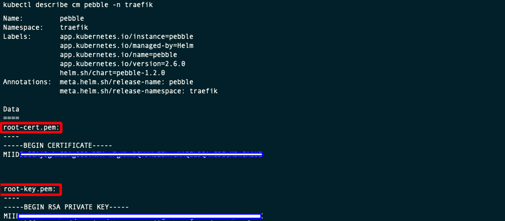

- If you haven't already, create a new namespace called traefik, using this file [00-traefik-namespace.yaml](00-traefik-namespace.yaml).

    ```sh
    kubectl apply -f 00-traefik-namespace.yaml
    kubectl get ns
    ```

    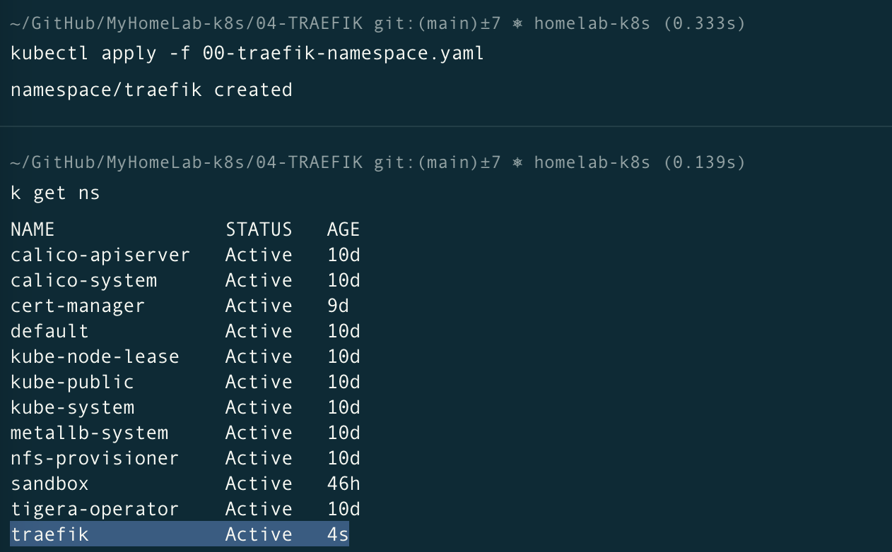

- From your laptop with access the the Kubernetes Cluster, add the traefik repository and update it.
    ```sh
    helm repo add traefik https://traefik.github.io/charts
    helm repo update
    ```
    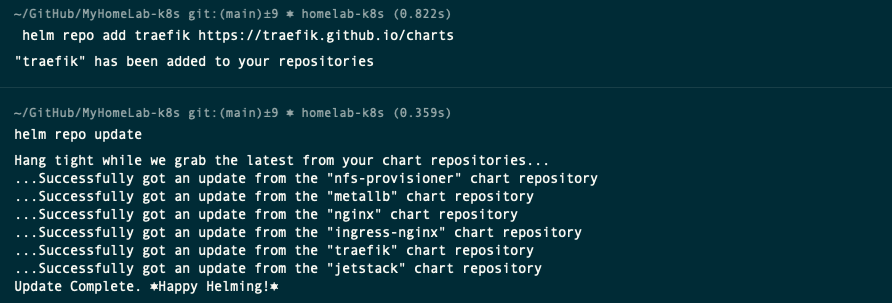

- Search for all the charts for the installed repository. You should find one called **traefik/traefik**
    ```sh
    helm search repo traefik
    ```
    

- Download the values file to configure the helm chart.
    ```sh
    cd ~/Documents/MyHomelab-k8s/04-TRAEFIK-PEBBLE/
    helm show values traefik/traefik > 02-traefik-values-with-pebble.yaml
    ``` 

- Then open the `02-traefik-values-with-pebble.yaml` file again, modify the following entries in the configuration.

    - `additionalArguments:` (Remove the square brackets and add the arguments as follows)

        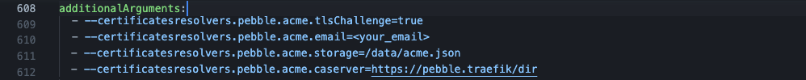

    - `volumes:` (Remove the square brackets and add the arguments as follows)
 
        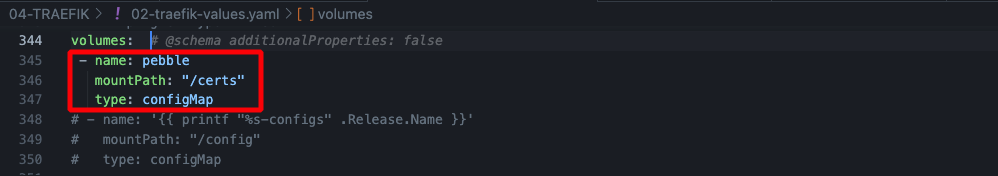

    - `env:` (Remove the square brackets and add the following information)

        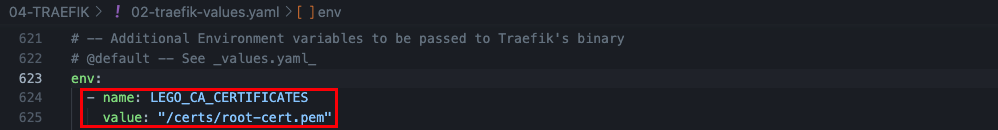

    - `logs.general.level: ERROR`

         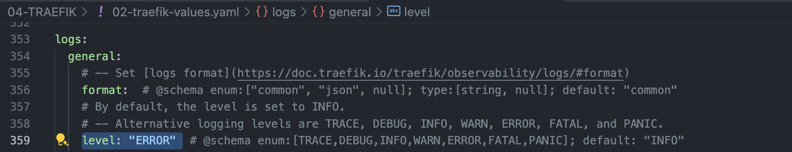

    - `service.loadBalancerClass: "metallb"`

        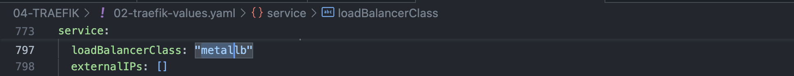

        > Note: Make sure to set the LoadBalancer Class is set to "metallb", and matches the LoadBalancer Class defined before: [02-metallb-values.yaml](../02-METALLB/02-metallb-values.yaml). This should ensure an External IP has been assigned to the traefik service.

    
    - `ingressRoute.dashboard.enabled: true`

        `ingressRoute.dashboard.matchRule: Host(`traefik.example.com`)

        `ingressRoute.dashboard.entryPoints: ["websecure"]`

        `ingressRoute.dashboard.tls.enable: true` (Remove the brackets and add the following information)

        `ingressRoute.dashboard.tls.certResolver: pebble` 

        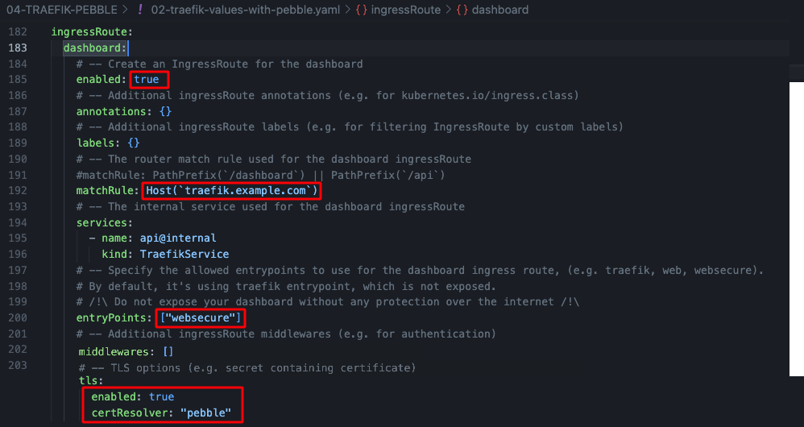

        > Note: We'll enable the Dashboard for now to troubleshoot the rest of the deployment. 
        >
        > Do not expose your dashboard without any protection over the internet. Make sure authentication is enabled.
        >
        > Documentation [Traefik: API](https://doc.traefik.io/traefik/operations/api/).
        >
        > Documentation [Traefik: Dashboard](https://doc.traefik.io/traefik/operations/dashboard/)

## Install the Traefik Helm chart

-  Install the Traefik helm chart, using this file [02-traefik-values-with-pebble.yaml](02-traefik-values-with-pebble.yaml).
    ```sh
    helm install traefik traefik/traefik --namespace traefik --values=02-traefik-values-with-pebble.yaml
    ```

    > Note:
    >The Traefik Helm chart will deploy the following Kubernetes resources:
    > 1. ServiceAccount - Used for Traefik's identity in the cluster
    > 2. ClusterRole - Defines the permissions Traefik needs across the cluster
    > 3. ClusterRoleBinding - Binds the ClusterRole to the ServiceAccount
    > 4. Deployment - The main Traefik controller deployment
    > 5. IngressClass - Defines Traefik as an available ingress controller class
    > 6. Service - The service that exposes Traefik to handle incoming traffic

    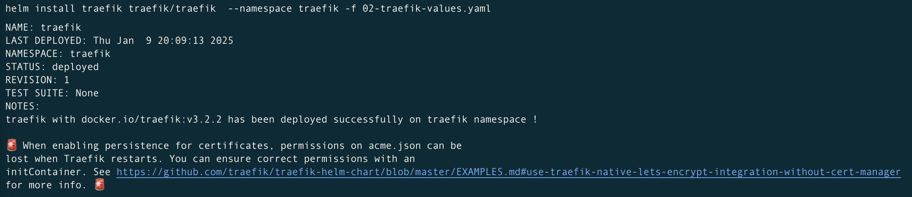

- Confirm a service type MetalLB LoadBalancer has been created and an external-IP has been assigned.

    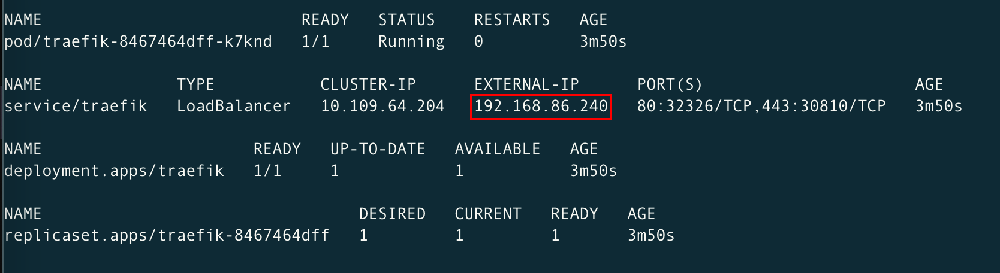

- If the installation fails, use this command to uninstall the helm, make sure all the resources have been removed and try again.

    ```sh
    helm uninstall traefik -n traefik
    watch kubectl get all -n traefik
    ```

- Modify the `/etc/hosts`. Enter the record based on the ip address provided by the ingress controller.
    ```sh
    sudo vi /etc/hosts
    ```
    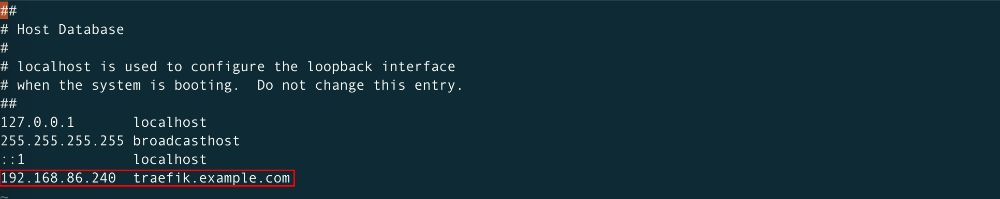

- Then open a browser and navigate to [https://traefik.example.com/](https://traefik.example.com/). You should be able to open the Traefik Dashboard.

    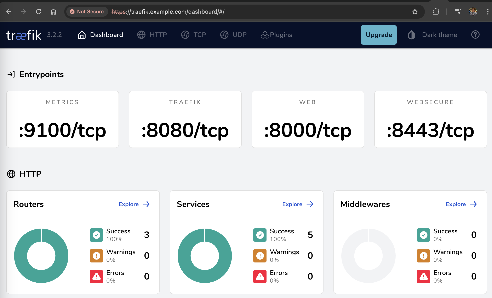

    > Note: HTTPS must be used, as redirection from HTTP to HTTPS hasn't been enabled yet.

- When you inspect the certificate in your browser, you'll notice it has been issued by Pebble. However, it's not a valid certificate yet.

    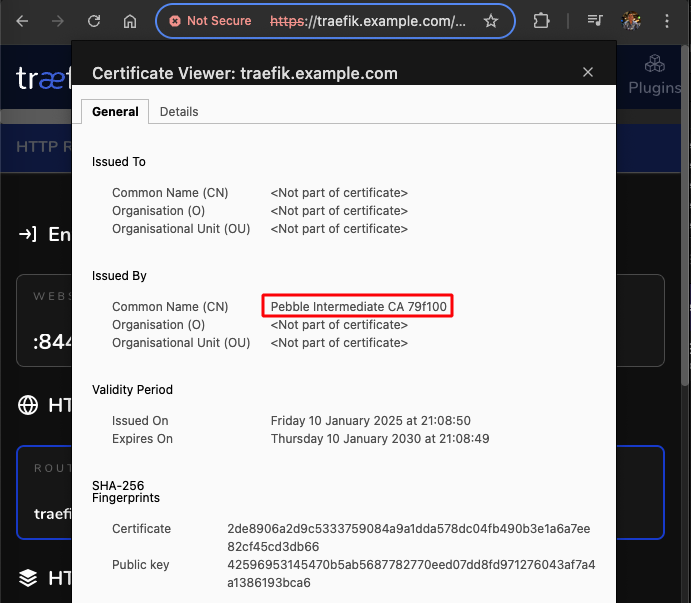

- The Traefik Dashboard will also show the dashboard itself is TLS enable, and the entrypoint is `websecure` (HTTPS).

    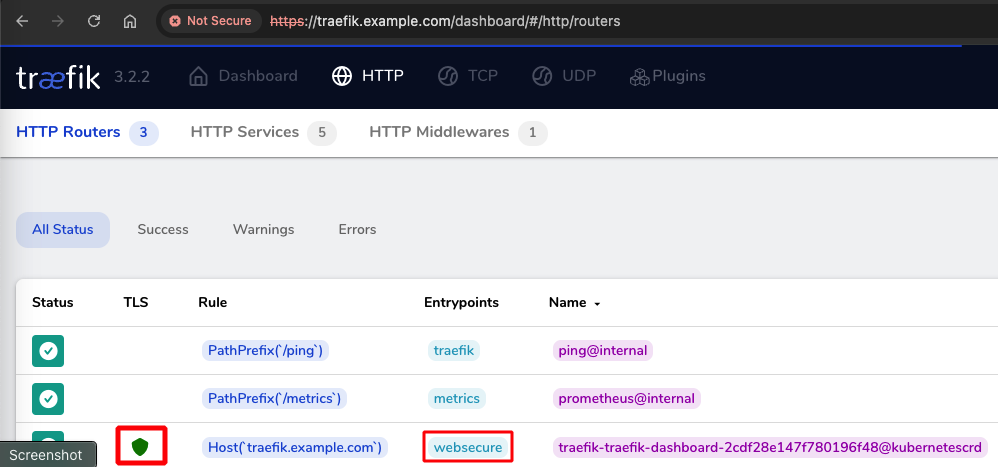

- You can also confirm the certificate has been loaded in the pod, by entering the pods /cert folder.

    ```sh
    kubectl get pods -n traefik
    kubectl exec -it traefik-74bcc5969d-8rcf7 -n traefik -- /bin/sh
    cd /certs
    ls -lht
    ```
    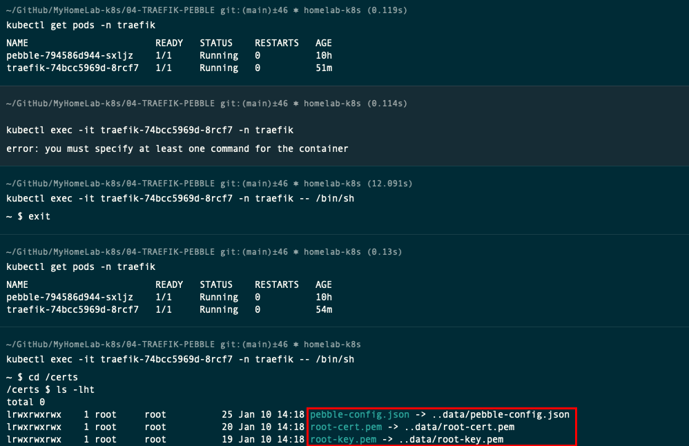


## Enable Traefik Dashboard Authorisation

- Generate a Base64-encoded HTTP Basic Authentication credential pair for a username and password specified.
    ```sh
    htpasswd -nb <your_username> <your_password> | base64
    ```

- Create the Traefik Dashboard credentials and Middleware using this file [03-traefik-dashboard-credentials.yaml](03-traefik-dashboard-credentials.yaml)

    > ⚠️ **Warning**: 
    > 
    > You should replace Replace the Base64 encoded HTTP authentication credential with your own, on this yaml file.

    ```sh
    code 03-traefik-dashboard-credentials.yaml
    # Replace the Base64 encoded HTTP authentication credential with your own.
    kubectl apply -f 03-traefik-dashboard-credentials.yaml -n traefik
    kubectl describe secrets traefik-credentials -n traefik
    kubectl describe middleware auth -n traefik
    ```
    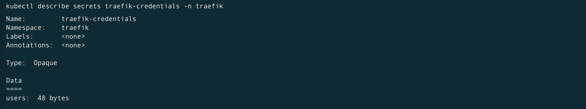

    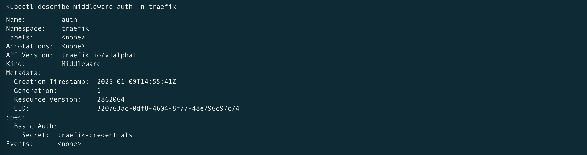

- Then open the `02-traefik-values-with-pebble.yaml` file again, modify the following entries in the configuration.

    - `ingressRoute.dashboard.middlewares: auth` (Remove the square brackets and add the following information)

    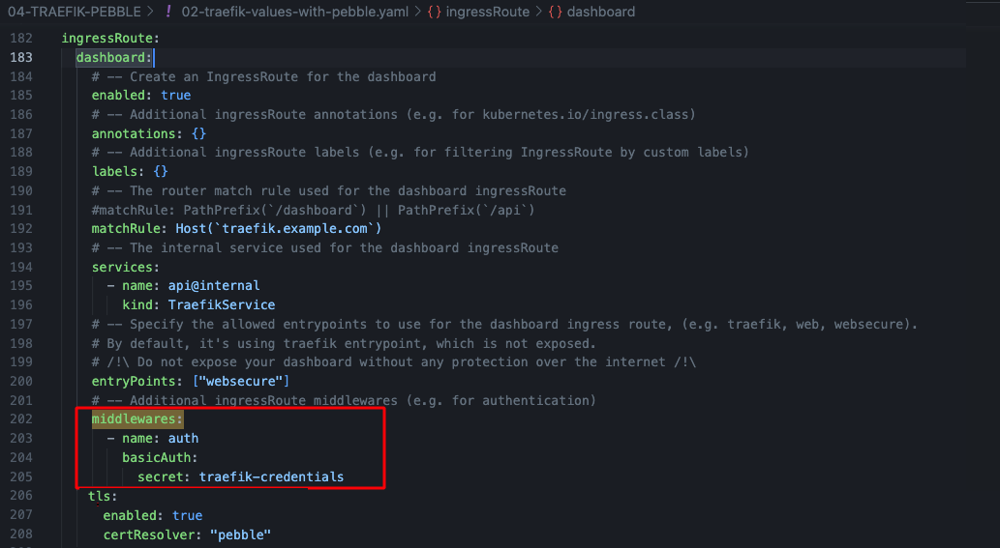

-  Upgrade the Traefik helm chart, using this file [02-traefik-values-with-pebble.yaml](02-traefik-values-with-pebble.yaml).
    ```sh
    helm upgrade traefik traefik/traefik --namespace traefik --values=02-traefik-values-with-pebble.yaml
    ```

- Confirm the IngressRoute has been modified
    ```sh
    kubectl describe ingressroute traefik-dashboard -n traefik
    ```
    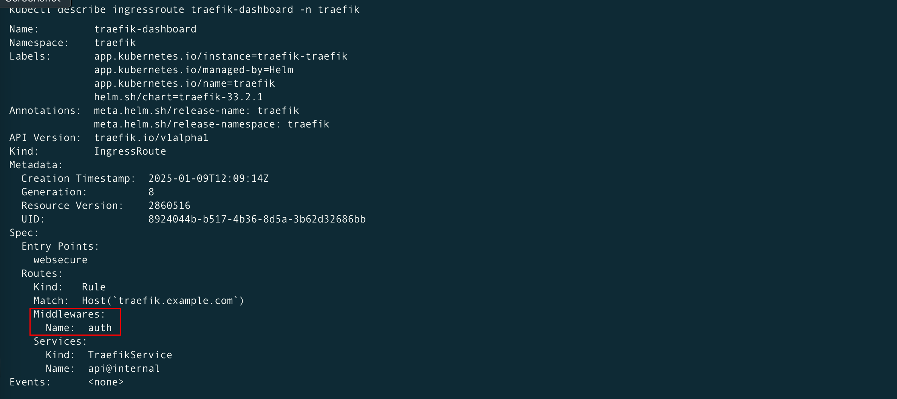

- Then open a browser and navigate to [https://traefik.example.com/](https://traefik.example.com/). You should be prompted to enter a username and passsword.

    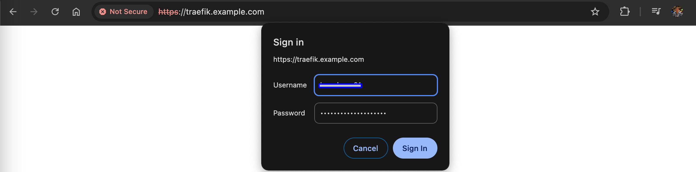
