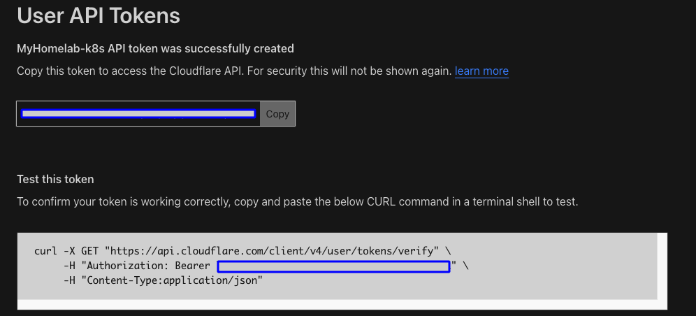

# Deploying an Ingress Controller using Traefik in Kubernetes

Official Documentation: 

- [Traefik: Install using the Helm Chart](https://doc.traefik.io/traefik/getting-started/install-traefik/#use-the-helm-chart)

- [Traefik: Let's Encrypt](https://doc.traefik.io/traefik/https/acme/)

- [Traefik & Kubernetes](https://doc.traefik.io/traefik/providers/kubernetes-ingress/)

YouTube Videos: 
- [How to use Traefik as a Reverse Proxy in Kubernetes? // Ingress Controller Tutorial](https://www.youtube.com/watch?v=n5dpQLqOfqM&t=270s)

- [Kubernetes - On prem install - Load Balancer and Ingress Controller](https://www.youtube.com/watch?v=9iJLw7pUCIk)

## Prerequisites
- A running Kubernetes cluster 1.2++
- A NFS server with a NFS provisioner chart installed and working.
- Certificate Manager is not required.
- `kubectl` command-line tool configured to interact with your cluster
- `helm` command-line tool installed on your local machine version 3.9+

## Adjust DNS records and create API Key in Cloudflare

- You must adjust DNS to Cloudflare nameserver by changing your DNS record point to Cloudflare. This example shows chaning NameCheap to point to Cloudflare.

    Documentation: [How to set up DNS records for your domain in a Cloudflare account](https://www.namecheap.com/support/knowledgebase/article.aspx/9607/2210/how-to-set-up-dns-records-for-your-domain-in-a-cloudflare-account/)

    

- Create a Cloudflare API token for use in cert-manager. Create and verify the domain you want to create an SSL certificate. 

    Documentation: [Lego > DNS Providers > Cloudflare](https://go-acme.github.io/lego/dns/cloudflare/)

    - Go to [Cloudflare dashboard](https://dash.cloudflare.com/) > [My Profile](https://dash.cloudflare.com/profile) (Right top corner) > API Tokens. 
    
        

    - Click Create Token button selecting the "Edit Zone DNS" option.

        

    - Then, fill Permission section form below.

        

    - Take note of the API Token generated.

        

# Create Namespace and Cloudflare credentials

- Create a new namespace called traefik, suing this file [00-cert-manager-namespace.yaml](00-cert-manager-namespace.yaml).

    ```sh
    kubectl create ns traefik
    kubectl get ns
    ```
    

- Create the Cloudflare credentials using this file [01-traefik-credentials.yaml](01-traefik-credentials.yaml)

    > ⚠️ **Warning**: 
    > 
    > You should replace this email address and API key with your own, on the traefik-credentials yaml file.

    ```sh
    code 01-traefik-credentials.yaml
    # Replace the email address and API Key with your own.
    kubectl apply -f 01-traefik-credentials.yaml
    kubectl describe secrets cloudflare-credentials -n traefik
    ```
    

## Download the traefik Helm Repository, modify the configuration and deploy it

- From your laptop with access the the Kubernetes Cluster, add the traefik repository and update it.
    ```sh
    helm repo add traefik https://traefik.github.io/charts
    helm repo update
    ```
    

- Search for all the charts for the installed repository. You should find one called **traefik/traefik**
    ```sh
    helm search repo traefik
    ```
    

- Deploy the traefik helm chart, using this file [02-traefik-custom-values.yaml](02-traefik-custom-values.yaml). 

    Here is a template for the traefik values: [traefik-helm-chart/traefik/values.yaml](https://github.com/traefik/traefik-helm-chart/blob/master/traefik/values.yaml)

    > ⚠️ **Warning**: 
    > 
    > 1. You should replace this email address with your own, on the traefik-custom-values yaml file.
    >
    > 2. Make sure to set the LoadBalancer Class is set to "metallb", and matches the LoadBalancer Class defined before: [02-metallb-values.yaml](../02-METALLB/02-metallb-values.yaml). This should ensure an External IP has been assigned to the traefik service.

    ```sh
    code 02-traefik-custom-values.yaml
    # Replace the email address with your own.
    helm install traefik traefik/traefik --namespace traefik --values=02-traefik-custom-values.yaml
    watch kubectl get all -n traefik
    ```

    

- If the installation fails, use this command to uninstall the helm, make sure all the resources have been removed and try again.

    ```sh
    helm uninstall traefik -n traefik
    watch kubectl get all -n traefik
    ```

    > Note:
    >The Traefik Helm chart will deploy the following Kubernetes resources:
    > 1. ServiceAccount - Used for Traefik's identity in the cluster
    > 2. ClusterRole - Defines the permissions Traefik needs across the cluster
    > 3. ClusterRoleBinding - Binds the ClusterRole to the ServiceAccount
    > 4. Deployment - The main Traefik controller deployment
    > 5. IngressClass - Defines Traefik as an available ingress controller class
    > 6. Service - The service that exposes Traefik to handle incoming traffic


- Confirm a service type LoadBalancer has been created and an external-IP has been assigned. Then open a browser and navigate to https://<external-ip>. You should be able to open a page indicating `404 page not found` message.

    

- SSH to your NFS server and make sure the `SUCCESS` and `acme-cloudflare.json` files were created.

    ```sh
    ssh homelab-k8s-nfs
    cd /mnt/volume1/kubedata-prod/nfsprov/
    cd traefik-traefik-pvc-<automatically_assigned_ID>
    ls -lht
    ```
    

