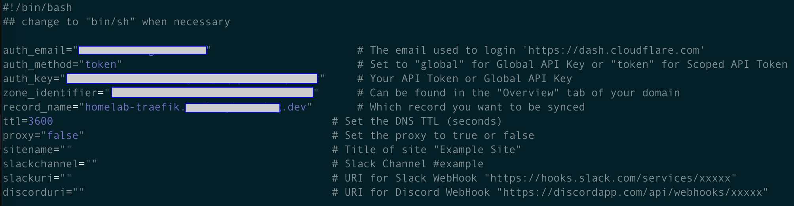
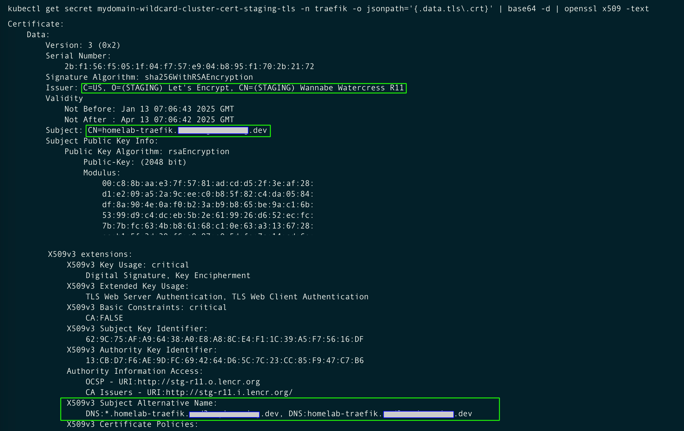

# Allow HTTPS traffic to your Traefik deployment

Documentation: 

- [Traefik: Let's Encrypt](https://doc.traefik.io/traefik/https/acme/)

- [Cert Manager: DNS Validation](https://cert-manager.io/docs/tutorials/acme/dns-validation/)

- [How to set up DNS records for your domain in a Cloudflare account](https://www.namecheap.com/support/knowledgebase/article.aspx/9607/2210/how-to-set-up-dns-records-for-your-domain-in-a-cloudflare-account/)
    
- [Cloudflare: Manage DNS records](https://developers.cloudflare.com/dns/manage-dns-records/how-to/create-dns-records/)

YouTube Videos: 

- [SSL Certificates Made EASY With Traefik Proxy, Clouflare, and Let's Encrypt - Tutorial](https://www.youtube.com/watch?v=XH9XgiVM_z4)

- [DDNS on a Raspberry Pi using the Cloudflare API (Dynamic DNS)](https://youtu.be/rI-XxnyWFnM?si=wAw5iDKA4pNoabVZ)

## Prerequisites
- A running Kubernetes cluster 1.2++
- A NFS server with a NFS provisioner chart installed and working.
- `kubectl` command-line tool configured to interact with your cluster
- `helm` command-line tool installed on your local machine version 3.9+


## Introduction

Let's Encrypt has two ways to complete a challange: TLS challenge (ports forwarded required) or DNS challenge (you simply need API access to your DNS provider).

In a DNS challange what Let's Encrypt does is login to CloudFlare with your credentials (Email and API Key), and create a temporary record. then, when Let's Encrypt find the record in the domain, it confirms you own the domain. This verifies your identify and provides a valid certificate.


## Set up a Dynamic DNS records for your domain (i.e. NameCheap) in a Cloudflare account

- Login to your CloudFlare account [Cloudflare Dashboard](https://dash.cloudflare.com/login), and select **Add a domain**. Depending on your site setup, you may want to adjust the proxy status for certain A, AAAA, or CNAME records.

    

    

- Once you have added a domain (also known as a zone) to Cloudflare, that domain will receive two assigned authoritative nameservers. Before your domain can begin using Cloudflare for DNS resolution, you need to add these nameservers at your registrar.

    

- Login to your NameCheap account [NameCheap](https://ap.www.namecheap.com/), go to Dashboard and click on the link to **Manage** your domain. 

- Adjust your **NameServers** settings to point to the to Cloudflare nameservers.

    

- Disable DNSSEC.

    


### Create API Key in Cloudflare

- Create a Cloudflare API token for use in cert-manager. Create and verify the domain you want to create an SSL certificate. 

    Documentation: [Lego > DNS Providers > Cloudflare](https://go-acme.github.io/lego/dns/cloudflare/)

    - Go to [Cloudflare dashboard](https://dash.cloudflare.com/) > [My Profile](https://dash.cloudflare.com/profile) (Right top corner) > API Tokens. 
    
        

    - Click Create Token button selecting the "Edit Zone DNS" option.

        

    - Then, fill Permission section form below.

        

    - Take note of the API Token generated.

        


## Create a DNS record in Cloudflare for your Trafik Server

- Back in CloudFlare, create a DNS record to point to a fase public IP address. We'll update that later.

    > Note: 
    >
    > The Proxy status of a DNS record affects how Cloudflare treats incoming traffic to that record. Cloudflare recommends enabling our proxy for all A, AAAA, and CNAME records that are used for serving web traffic.

    

- Wait about a minute, and try to resolve the name on your laptop

    ```sh
    dig homelab-traefik.<your_domain> 8.8.8.8
    ```
    

- In the CloudFlare Dashboard, you'll find your ZoneID and Account ID. Take note of those values

    

Now, we'll set up an script on any of your linux servers on your homelab, to automatically update your public IP address on your DNS record.

- Download the script from here: [cloudflare-ddns-updater](https://github.com/K0p1-Git/cloudflare-ddns-updater). We'll need the script `cloudflare-template.sh`.
    ```sh
    sudo su - 
    vi renew_ip_cloudflare.sh
    # Copy the content of the file
    ```

- Then change the following parameters, save the file and close it.

    - `auth_email` The email used to login to Cloudflare
    - `auth_method` Leave the default token value
    - `auth_key` API Key set up previusly
    - `zone_identifier` Value from the Overview page of the CloudFlare Dahsboard
    - `record_name` Fully qualified name, i.e. homelab.<yourdomain>.dev

    

- Change the script permissions.
    ```sh
    chmod +x renew_ip_cloudflare.sh
    ```

- Excute the script, and make sure it updates the DNS record in Cloudflare. 
    ```sh
    ./renew_ip_cloudflare.sh
    ```
    


- Schedule a crontab job to run this script every night at 12:10 am.
    ```sh
    crontab -e
    # Enter this line
    0 * * * * /root/renew_ip_cloudflare.sh >> /var/log/renew_ip_cloudflare.log 2>&1
    # Save an exit
    # Then restart the crontab service
    systemctl restart cron
    ```

## Allow HTTPS traffic to your Traefik Server

- Login to your home router, and enable DMZ. Specify the local IP address (MetlaLB) assigned to your Traefik deployment.

    

- Port forwarding allows remote computers to connect to a specific computer or service within a private local area network (LAN). Add the HTTPS traffic and port TCP/443 for the IP address assigned to your Traefik deployment.

    

- You don't have do enable DDNS, as the script disacribed below will take care of it.

    

- Try to access your Traefik dashboard. [https://homelab-traefik.<your_domain>.dev/](https://homelab-traefik.<your_domain>.dev/). This attemp won't be able to open the dashboard, as we need to set up the TLS certificate.

    


## Deploying Certificate Manager with DNS Challange

- Create the Cloudflare credentials using this file [01-cert-manager-cloudflare-credentials.yaml](01-cert-manager-cloudflare-credentials.yaml). This time the credentials will be stored in the `cert-manager` namespace.

    > ⚠️ **Warning**: 
    > 
    > You should replace this email address and API key with your own, on the traefik-credentials yaml file.

    ```sh
    code 01-cert-manager-cloudflare-credentials.yaml
    # Replace the email address and API Key with your own.
    kubectl apply -f 01-cert-manager-cloudflare-credentials.yaml
    kubectl describe secrets cloudflare-credentials -n cert-manager
    ```
     

- Create a **Staging ClusterIssuer**, using this file [02-cluster-issuer-DNS-Challenge-staging.yaml](02-cluster-issuer-DNS-Challenge-staging.yaml)

    The Cluster Issuer will create a Secret defined as `dns-challenge-acme-staging`. The Secret will be used to store the account's private key.

    Start with the ACME staging server, as if the production environment is abused, your IP address may be banned for a few days after several failed attempts.

    > ⚠️ **Warning**: 
    >
    > You should replace this email address with your own.
    >
    > Let's Encrypt will use this to contact you about expiring certificates, and issues related to your account.

    ```sh
    code 02-cluster-issuer-DNS-Challenge-staging.yaml
    # Replace the email address with your own.

    kubectl apply -f 02-cluster-issuer-DNS-Challenge-staging.yaml
    kubectl get secrets -n cert-manager
    ```

- Confirm the Cluster Issuer was created successfully.
    ```sh
    kubectl get pods -A | grep cert-manager
    kubectl logs cert-manager-<tab> -n cert-manager --tail 100 -f
    ```
     

- Additonally, create a **Production ClusterIssuer**, using this file [03-cluster-issuer-DNS-Challenge-prod.yaml](03-cluster-issuer-DNS-Challenge-prod.yaml)

    The Cluster Issuer will create a Secret defined as `dns-challenge-acme-prod`. The Secret will be used to store the account's private key.

    ```sh
    code 03-cluster-issuer-DNS-Challenge-prod.yaml
    # Replace the email address with your own.

    kubectl apply -f 03-cluster-issuer-DNS-Challenge-prod.yaml
    kubectl get secrets -n cert-manager

    kubectl get pods -A | grep cert-manager
    kubectl logs cert-manager-<tab> -n cert-manager --tail 100 -f
    ```

- Create a new **Staging*** certificate using this file [test-traefik-certificate-DNS-staging.yaml](test-traefik-certificate-DNS-staging.yaml).

    ```sh
    kubectl apply -f test-traefik-certificate-DNS-staging.yaml
    ```

- Then confirm the events on the certificate recently created, to confirm this was successfull. The produce a valit certificate by Let's Encrypt may take a few minutes.

    ```sh
    watch kubectl describe certificates mydomain-wildcard-cluster-cert-staging -n traefik
    ```
    

- You can also inspect the certificate produced

    ```sh
    kubectl get secret mydomain-wildcard-cluster-cert-staging-tls -n traefik -o jsonpath='{.data.tls\.crt}' | base64 -d | openssl x509 -text
    ```
    

- You can delete the Let's Encrypt **Staging*** certificate.

    ```sh
    kubectl delete -f test-traefik-certificate-DNS-staging.yaml
    ```

- Create a new **Production** certificate using this file [04-traefik-certificate-DNS-prod.yaml](04-traefik-certificate-DNS-prod.yaml).

    ```sh
    kubectl apply -f 04-traefik-certificate-DNS-prod.yaml

    watch kubectl describe certificates mydomain-wildcard-cluster-cert-prod -n traefik

    kubectl get secret mydomain-wildcard-cluster-cert-prod-tls -n traefik -o jsonpath='{.data.tls\.crt}' | base64 -d | openssl x509 -text
    ```

    


## Update the Traefik deployment with a valid TLS certificate

- Make a copy of the Traefik Values file, or use this file [05-traefik-values-DNS-Challange.yaml](05-traefik-values-DNS-Challange.yaml), and modify the following entries in the configuration.

    > ⚠️ **Warning**: You should enter your own domain name, on the traefik-custom-values yaml file.

    -  `ingressRoute.matchRule: Host(`homelab-traefik.<your_domain>`)`

    - `ingressRoute.dashboard.tls.secretName: mydomain-wildcard-cluster-cert-prod-tls`

    

    - `ports.web.websecure.tls.enabled: true`

    - `ports.web.websecure.tls.secretName: mydomain-wildcard-cluster-cert-prod-tls`

    

-  Upgrade the Traefik helm chart.
    ```sh
    helm upgrade traefik traefik/traefik --namespace traefik --values=05-traefik-values-DNS-Challange.yaml
    ```

- Confirm the IngressRoute has been modified
    ```sh
    kubectl describe ingressroute traefik-dashboard -n traefik
    ```
    

- Then open a browser and navigate to [https://homelab-traefik.<your_domain>/](https://homelab-traefik.<your_domain>/). Inspect the certificate and confirm it's valid.

    
