# Certificate for a Dynamic DNS Domain in Kubernetes through cert-manager

This guide will help you set up a certificate for a Dynamic DNS domain in your Kubernetes cluster using cert-manager.

YouTube video: [[09.02] Certificate for a dynamic DNS domain in Kubernetes through cert-manager](https://www.youtube.com/watch?v=KVoRYtLGTjY&list=PLVBNl4E-lnBJR9UwFd5w05ama_4IkV-8I&index=11)

## Prerequisites

- A dynamic DNS provider (e.g. Cloudflare).
- A Domain name that you own (e.g. NameCheap, Cloudflare, etc)
- A certificate Manager installed in your Kubernetes cluster (previous step).

## Adjust DNS records in Cloudflare

- You must adjust DNS to Cloudflare nameserver by changing your DNS record point to Cloudflare. This example shows chaning NameCheap to point to Cloudflare.

    [How to set up DNS records for your domain in a Cloudflare account](https://www.namecheap.com/support/knowledgebase/article.aspx/9607/2210/how-to-set-up-dns-records-for-your-domain-in-a-cloudflare-account/)

    

- Create a Cloudflare API token for use in cert-manager. Create and verify the domain you want to create an SSL certificate. 

    Documentation: [Create Cert-manager ClustterIssuer with Cloudflare for Automate issue and renew](https://nolifelover.medium.com/create-cert-manager-clustterissuer-with-cloudflare-for-automate-issue-and-renew-lets-encrypt-ssl-4877d3f12b44)

    - Go to [Cloudflare dashboard](https://dash.cloudflare.com/) > [My Profile](https://dash.cloudflare.com/profile) (Right top corner) > API Tokens. 
    
        

    - Click Create Token button selecting the "Edit Zone DNS" option.

        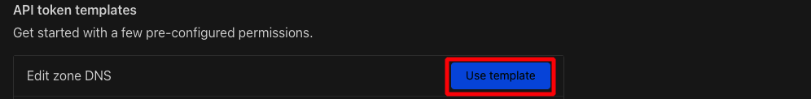

    - Then, fill Permission section form below.

        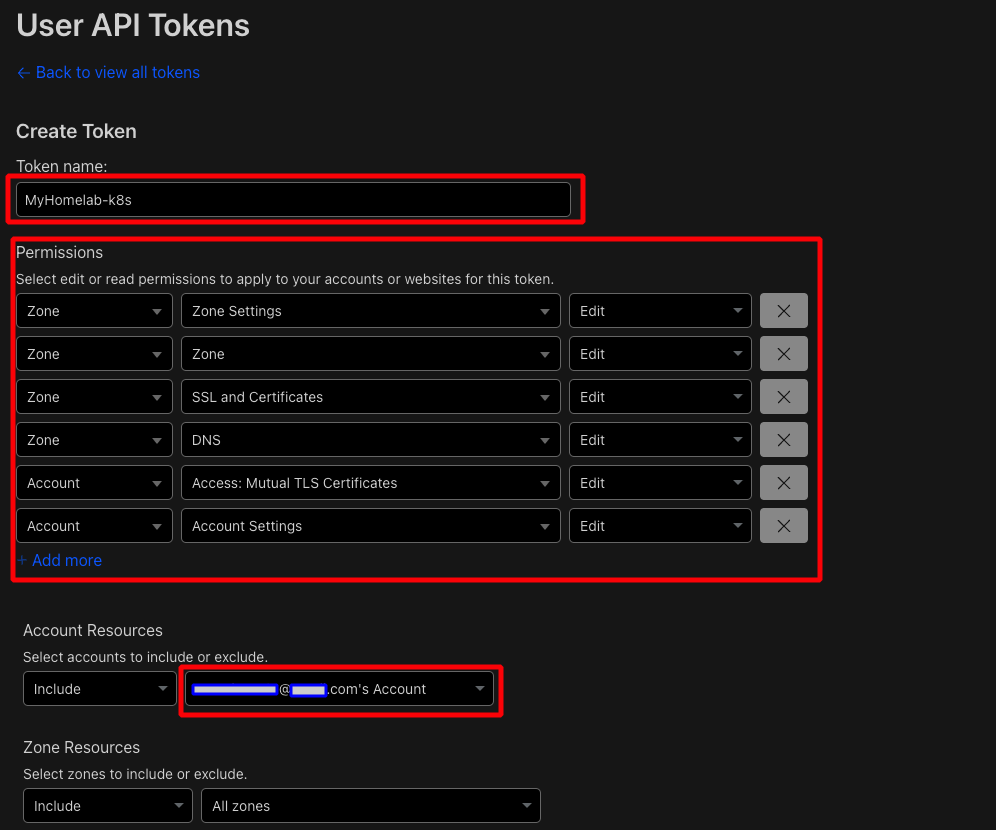

    - Take note of the API Token generated.

        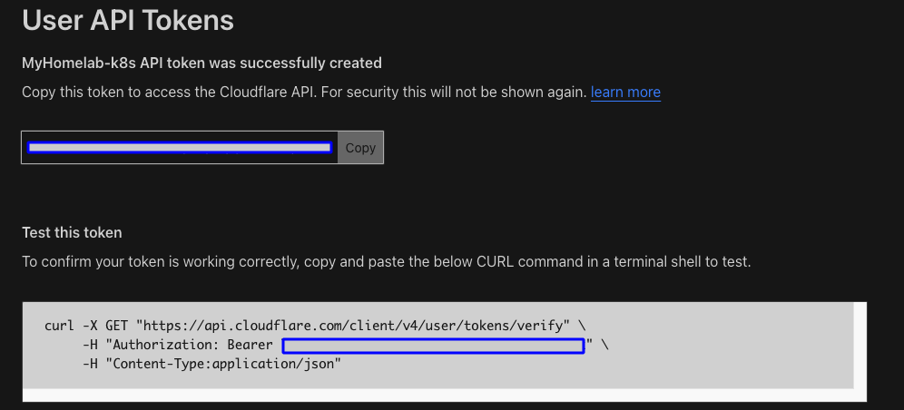


## Modify the configuration for the jetstack/cert-manager Helm Repository re-deploy

- Make a copy of the values file to configure the helm chart.

    ```sh
    cp ~/Documents/MyHomelab-k8s/04-CERTMANAGER/01-cert-manager-values.yaml ~/Documents/MyHomelab-k8s/05-DYNAMIC-DNS/01-cert-manager-values.yaml
    helm show values jetstack/cert-manager > 01-cert-manager-values.yaml
    ``` 

- To make changes to the existing `cert-manager` deployment, open this file in a editor, such as vim or Visual Studio code, and modify the following entries in the configuration.

    - `dns01RecursiveNameservers:` "8.8.8.8:53,1.1.1.1:53"

        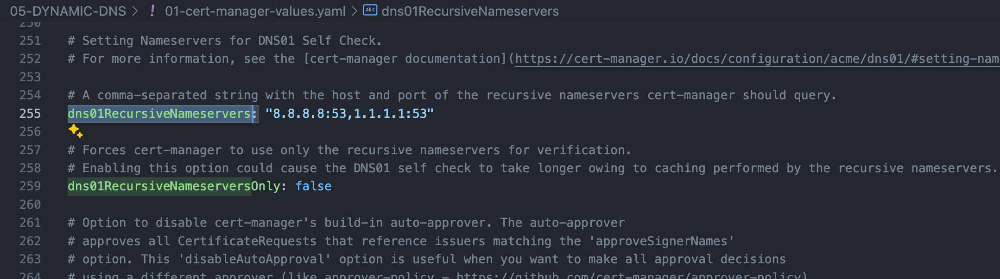

    > cert-manager will check the correct DNS records exist before attempting a DNS01 challenge. 
    >
    > By default cert-manager will use the recursive nameservers taken from /etc/resolv.conf to query for the authoritative nameservers, which it will then query directly to verify the DNS records exist.

- Upgrade the existing `cert-manager` deployment
    ```sh
    cd ~/Documents/MyHomelab-k8s/04-CERTMANAGER/
    helm upgrade cert-manager jetstack/cert-manager --namespace cert-manager -f 01-cert-manager-values.yaml
    ```
    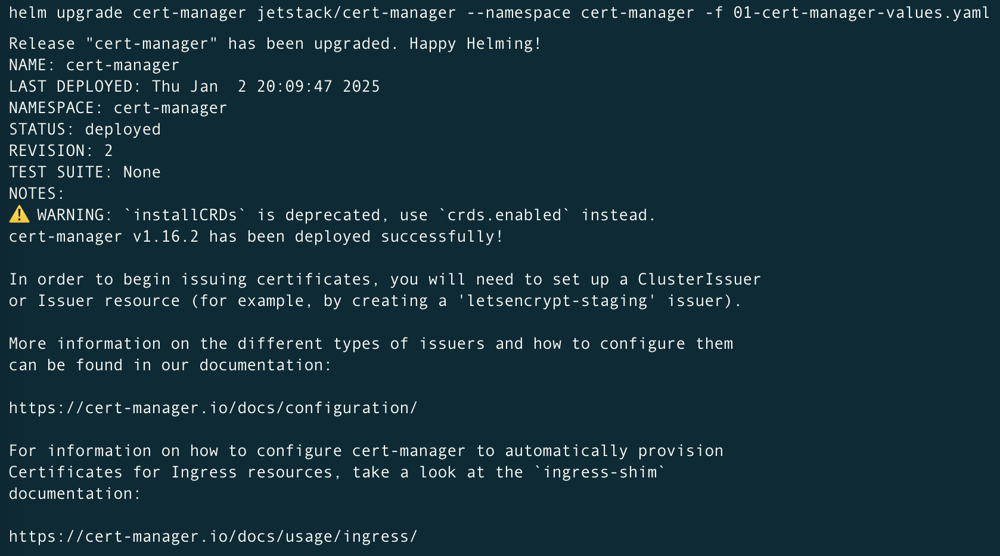

- Confirm the deployment configuration has been updated correctly.
    ```sh
    kubectl describe deployment cert-manager -n cert-manager
    ```
    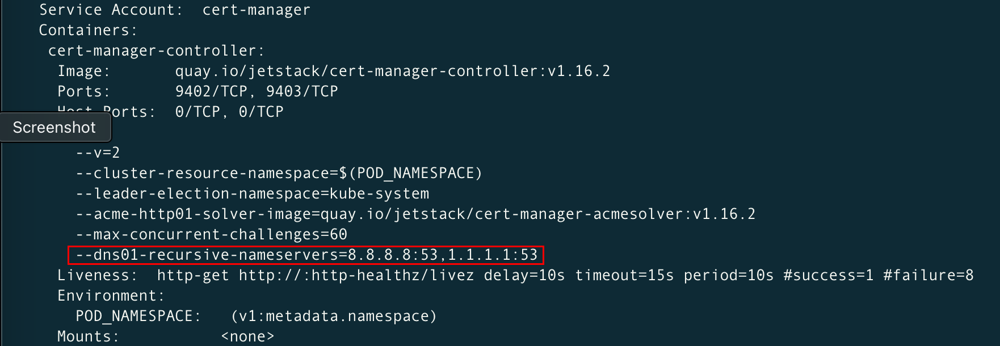


# Create a Kubernetes config for deploying ClustterIssuer with Cloudflare DNS proof

Official Documentation: [DNS01 Cloudflare](https://cert-manager.io/docs/configuration/acme/dns01/cloudflare/)

- Create a **Secret** and a **ClusterIssuer**, using this file [02-cluster-issuer-cloudflare.yaml](02-cluster-issuer-cloudflare.yaml)

    > You should replace this email address with your own.
    >
    > You also need to enter your Cloudflare API Token

    ```sh
    code 02-cluster-issuer-cloudflare.yaml 
    # Replace the email address with your own.
    kubectl apply -f 02-cluster-issuer-cloudflare.yaml
    kubectl get clusterissuer -A
    kubectl get secrets -A
    ```
    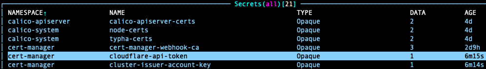

    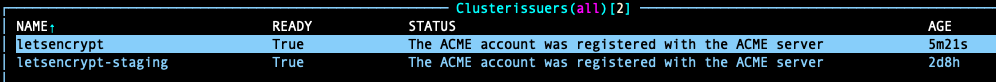

## Testing the certificate manager with TLS encrypted connection

- Create a namespace called test-web
    ```sh
    kubectl create ns test-web
    kubectl get ns
    ```
    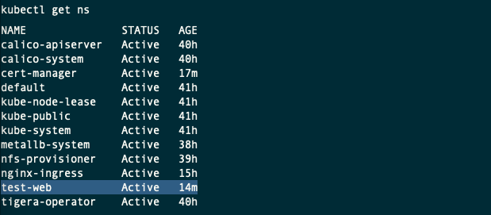

- Create a new nginx deployment, using this file [test-a-deployment.yaml](test-a-deployment.yaml)

    ```sh
    kubectl apply -f test-a-deployment.yaml
    watch kubectl get all -n test-web
    ```

- Expose the deployment as a **service** on port 80.

    ```sh
    kubectl expose deploy nginx-deploy-main -n test-web --port 80
    kubectl get svc -n test-web
    ```
    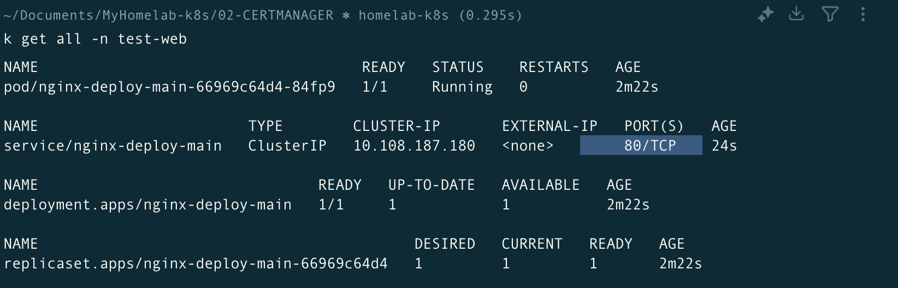

- Create a new ingress resource using this file [test-b-ingress.yaml](test-b-ingress.yaml).

    > Note: The ingress have a provider issuer, a host name 'testing-cert.com' and it will create a secret named `lets-encrypt-test`.

    ```sh
    kubectl apply -f test-b-ingress.yaml
    watch kubectl get all -n test-web 
    watch kubectl get secrets -n test-web
    watch kubectl get ingress -A
    ```

    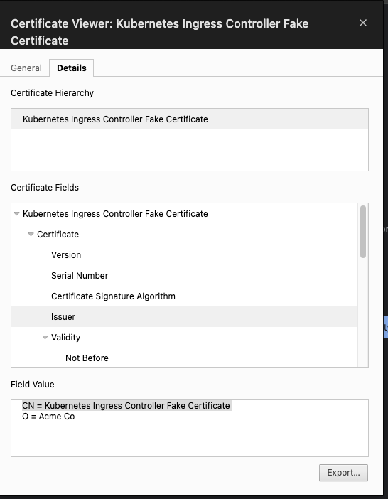


# TBA


https://cavecafe.medium.com/homelab-cloudflare-ddns-setup-09b37b54a7fb