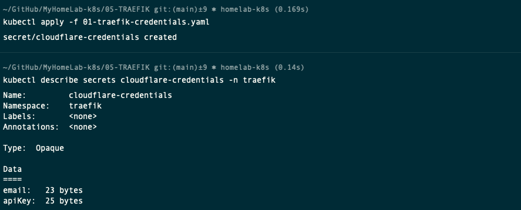

# Deploying Traefik Ingress Controller in Kubernetes

Official Documentation: 

- [Traefik: Install using the Helm Chart](https://doc.traefik.io/traefik/getting-started/install-traefik/#use-the-helm-chart)

- [Traefik: Let's Encrypt](https://doc.traefik.io/traefik/https/acme/)

- [Traefik & Kubernetes](https://doc.traefik.io/traefik/providers/kubernetes-ingress/)

YouTube Video: [How to use Traefik as a Reverse Proxy in Kubernetes? // Ingress Controller Tutorial](https://www.youtube.com/watch?v=n5dpQLqOfqM&t=270s)

## Prerequisites
- A running Kubernetes cluster 1.2++
- `kubectl` command-line tool configured to interact with your cluster
- `helm` command-line tool installed on your local machine version 3.9+

## Adjust DNS records and create API Key in Cloudflare

- You must adjust DNS to Cloudflare nameserver by changing your DNS record point to Cloudflare. This example shows chaning NameCheap to point to Cloudflare.

    Documentation: [How to set up DNS records for your domain in a Cloudflare account](https://www.namecheap.com/support/knowledgebase/article.aspx/9607/2210/how-to-set-up-dns-records-for-your-domain-in-a-cloudflare-account/)

    

- Create a Cloudflare API token for use in cert-manager. Create and verify the domain you want to create an SSL certificate. 

    Documentation: [Lego > DNS Providers > Cloudflare](https://go-acme.github.io/lego/dns/cloudflare/)

    - Go to [Cloudflare dashboard](https://dash.cloudflare.com/) > [My Profile](https://dash.cloudflare.com/profile) (Right top corner) > API Tokens. 
    
        

    - Click Create Token button selecting the "Edit Zone DNS" option.

        

    - Then, fill Permission section form below.

        

    - Take note of the API Token generated.

        

# Create Namespace and Cloudflare credentials

- Create a new namespace called traefik, suing this file [00-cert-manager-namespace.yaml](00-cert-manager-namespace.yaml).

    ```sh
    kubectl create ns traefik
    kubectl get ns
    ```
    

- Create the Cloudflare credentials using this file [01-traefik-credentials.yaml](01-traefik-credentials.yaml)

    > You should replace this email address with your own.
    >
    > You should replace this API key with your own.

    ```sh
    kubectl apply -f 01-traefik-credentials.yaml
    kubectl describe secrets cloudflare-credentials -n traefik
    ```
    


## Download the traefik Helm Repository and modify the configuration

- From your laptop with access the the Kubernetes Cluster, add the traefik repository and update it.
    ```sh
    helm repo add traefik https://traefik.github.io/charts
    helm repo update
    ```
    

- Search for all the charts for the installed repository. You should find one called **traefik/traefik**
    ```sh
    helm search repo traefik
    ```
    

- Deploy the traefik helm chart, using this file [02-traefik-arguments.yaml](02-traefik-arguments.yaml)
    ```sh
    helm install traefik traefik/traefik --namespace traefik --values=02-traefik-arguments.yaml
    watch kubectl get all -n traefik
    ```
>
>
>
>
>
>
> Warning  BackOff    6s (x5 over 53s)  kubelet            Back-off restarting failed container volume-permissions in pod traefik-57546f85d8-4p8vz_traefik(bae82a75-7d8c-4d2a-a8bd-dbb195865979)   
>
>
> PersistentVolumeClaim
>
>
>
