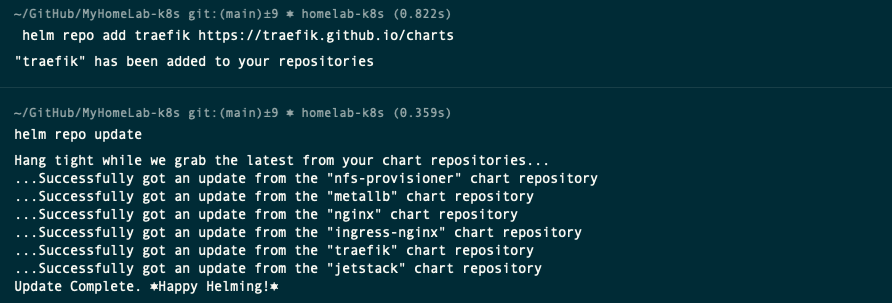
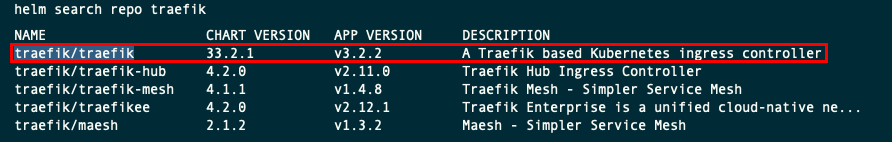
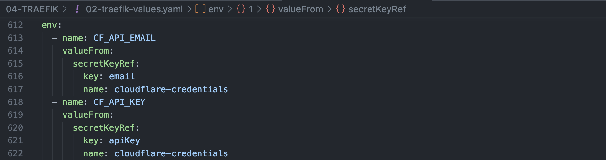
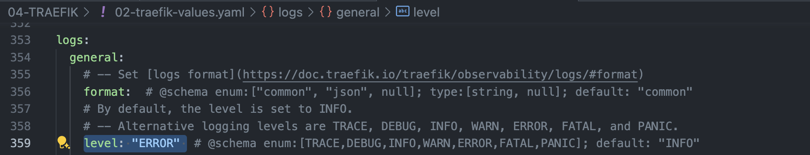
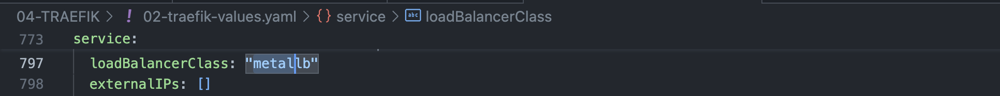
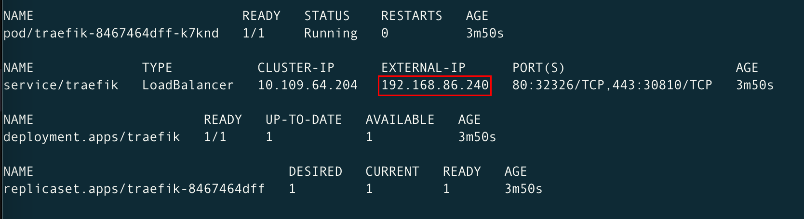

# Deploying an Ingress Controller using Traefik in Kubernetes - Certificates signed by Let's Encrypt

Documentation: 

- [Traefik: Install using the Helm Chart](https://doc.traefik.io/traefik/getting-started/install-traefik/#use-the-helm-chart)

- [Traefik: Let's Encrypt](https://doc.traefik.io/traefik/https/acme/)

- [Traefik & Kubernetes](https://doc.traefik.io/traefik/providers/kubernetes-ingress/)

YouTube Videos: 

- [How to use Traefik as a Reverse Proxy in Kubernetes? // Ingress Controller Tutorial](https://www.youtube.com/watch?v=n5dpQLqOfqM&t=270s)

- [Kubernetes - On prem install - Load Balancer and Ingress Controller](https://www.youtube.com/watch?v=9iJLw7pUCIk)

## File's replacement summary
- [01-traefik-cloudflare-credentials.yaml](01-traefik-cloudflare-credentials.yaml)
    - Replace email address 
    - Replace API Key 

- [02-traefik-values-with-lets-encrypt.yaml](02-traefik-values-with-lets-encrypt.yaml)
    - Replace email address 

- [03-traefik-dashboard-credentials.yaml](03-traefik-dashboard-credentials.yaml)
    - Replace the Base64 encoded HTTP authentication credential 


## Prerequisites
- A running Kubernetes cluster 1.2++
- A NFS server with a NFS provisioner chart installed and working.
- `kubectl` command-line tool configured to interact with your cluster
- `helm` command-line tool installed on your local machine version 3.9+


## Download the Traefik Helm Repository, modify the configuration and deploy it

- Create a new namespace called traefik, using this file [00-traefik-namespace.yaml](00-traefik-namespace.yaml).

    ```sh
    kubectl apply -f 00-traefik-namespace.yaml
    kubectl get ns
    ```

    

- Create the Cloudflare credentials using this file [01-traefik-cloudflare-credentials.yaml](01-traefik-cloudflare-credentials.yaml)

    > ⚠️ **Warning**: 
    > 
    > You should replace this email address and API key with your own, on the traefik-credentials yaml file.

    ```sh
    code 01-traefik-cloudflare-credentials.yaml
    # Replace the email address and API Key with your own.
    kubectl apply -f 01-traefik-cloudflare-credentials.yaml
    kubectl describe secrets cloudflare-credentials -n traefik
    ```
    

- You can confirm the content of the secret with this command. 
    ```sh
    kubectl get secret cloudflare-credentials -n traefik -o jsonpath='{.data.email}' | base64 -d; echo; kubectl get secret cloudflare-credentials -n traefik -o jsonpath='{.data.apiKey}' | base64 -d; echo
    ```

- From your laptop with access the the Kubernetes Cluster, add the traefik repository and update it.
    ```sh
    helm repo add traefik https://traefik.github.io/charts
    helm repo update
    ```
    

- Search for all the charts for the installed repository. You should find one called **traefik/traefik**
    ```sh
    helm search repo traefik
    ```
    

- Download the values file to configure the helm chart.
    ```sh
    cd ~/Documents/MyHomelab-k8s/06-TRAEFIK-LETS-ENCRYPT/
    helm show values traefik/traefik > 02-traefik-values-with-lets-encrypt.yaml
    ``` 

- Then open this file in a editor, and modify the following entries in the configuration.

    - `additionalArguments:` (Remove the square brackets and add the following information)

        > Documentation: [Traefik: dnsChallenge](https://doc.traefik.io/traefik/https/acme/#dnschallenge)
        >
        > ⚠️ **Warning**: You should replace this email address with your own, on the traefik-custom-values yaml file.

        

    - `env:` (Remove the square brackets and add the following information)

        > Documentation: [Lego - DNS Providers: Cloudflare](https://go-acme.github.io/lego/dns/cloudflare/)

        

    - `logs.general.level: ERROR`

         

    - `ports.web.redirectTo: websecure` (Optional: Redirect HTTP to HTTPS. Not enabled this time).
    
         

    - `persistence.enabled: true`

        `persistence.name: ssl-certs`

        `persistence.path: /ssl-certs`

         

    - `deployment.initContainers:` (Remove the square brackets and add the following information)
 
        

    - `ingressClass.enabled: true`

        `ingressClass.isDefaultClass: true`

        > Note: Set Traefik as your default Ingress Controller. Since version Kubernetes 1.29, you can have multiple Ingress Controllers.

        

    - `service.loadBalancerClass: "metallb"`

        > Note: Make sure to set the LoadBalancer Class is set to "metallb", and matches the LoadBalancer Class defined before: [02-metallb-values.yaml](../02-METALLB/02-metallb-values.yaml). This should ensure an External IP has been assigned to the traefik service.

        

    - `ingressRoute.dashboard.enabled: true`

        `ingressRoute.dashboard.entryPoints: ["websecure"]`

        `ingressRoute.dashboard.matchRule: Host(`traefik.example.com`)

        > Note: We'll enable the Dashboard for now to troubleshoot the rest of the deployment. 
        >
        > Do not expose your dashboard without any protection over the internet. Make sure authentication is enabled.
        >
        > Documentation [Traefik: API](https://doc.traefik.io/traefik/operations/api/).
        >
        > Documentation [Traefik: Dashboard](https://doc.traefik.io/traefik/operations/dashboard/)

        


## Install the Traefik Helm chart

- Deploy the Traefik helm chart, using this file [02-traefik-values-with-lets-encrypt.yaml](02-traefik-values-with-lets-encrypt.yaml).

    ```sh
    helm install traefik traefik/traefik  --namespace traefik -f 02-traefik-values-with-lets-encrypt.yaml
    watch kubectl get all -n traefik
    ```

    > Note:
    >The Traefik Helm chart will deploy the following Kubernetes resources:
    > 1. ServiceAccount - Used for Traefik's identity in the cluster
    > 2. ClusterRole - Defines the permissions Traefik needs across the cluster
    > 3. ClusterRoleBinding - Binds the ClusterRole to the ServiceAccount
    > 4. Deployment - The main Traefik controller deployment
    > 5. IngressClass - Defines Traefik as an available ingress controller class
    > 6. Service - The service that exposes Traefik to handle incoming traffic

    

- Confirm a service type MetalLB LoadBalancer has been created and an external-IP has been assigned.

    

- If the installation fails, use this command to uninstall the helm, make sure all the resources have been removed and try again.

    ```sh
    helm uninstall traefik -n traefik
    watch kubectl get all -n traefik
    ```

- Modify the `/etc/hosts`. Enter the record based on the ip address provided by the ingress controller.
    ```sh
    sudo vi /etc/hosts
    ```
    

- Then open a browser and navigate to [https://traefik.example.com/](https://traefik.example.com/). You should be able to open the Traefik Dashboard.

    

- SSH to your NFS server and make sure the `SUCCESS` and `acme-cloudflare.json` files were created.

    ```sh
    ssh homelab-k8s-nfs
    cd /mnt/volume1/kubedata-prod/nfsprov/
    cd traefik-traefik-pvc-<automatically_assigned_ID>
    ls -lht
    ```
    


## Enable Traefik Dashboard Authorisation

- Generate a Base64-encoded HTTP Basic Authentication credential pair for a username and password specified.
    ```sh
    htpasswd -nb <your_username> <your_password> | base64
    ``

- Create the Traefik Dashboard credentials and Middleware using this file [03-traefik-dashboard-credentials.yaml](03-traefik-dashboard-credentials.yaml)

    > ⚠️ **Warning**: 
    > 
    > You should replace the Base64 encoded HTTP authentication credential with your own, on this yaml file.

    ```sh
    code 03-traefik-dashboard-credentials.yaml
    # Replace the Base64 encoded HTTP authentication credential with your own.
    kubectl apply -f 03-traefik-dashboard-credentials.yaml -n traefik
    kubectl describe secrets traefik-credentials -n traefik
    kubectl describe middleware auth -n traefik
    ```
    

    

- Then open the `02-traefik-values-with-lets-encrypt.yaml` file again, modify the following entries in the configuration.

    - `ingressRoute.dashboard.middlewares: auth` (Remove the square brackets and add the following information)

    

-  Upgrade the Traefik helm chart, using this file [02-traefik-values-with-lets-encrypt.yaml](02-traefik-values-with-lets-encrypt.yaml).
    ```sh
    helm upgrade traefik traefik/traefik --namespace traefik --values=02-traefik-values-with-lets-encrypt.yaml
    ```

- Confirm the IngressRoute has been modified
    ```sh
    kubectl describe ingressroute traefik-dashboard -n traefik
    ```
    

- Then open a browser and navigate to [https://traefik.example.com/](https://traefik.example.com/). You should be prompted to enter a username and passsword.

    

