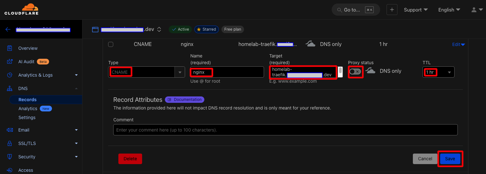
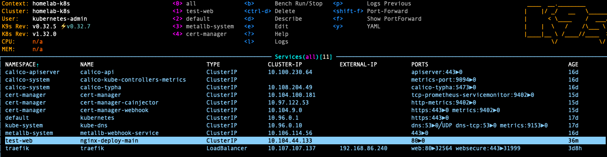
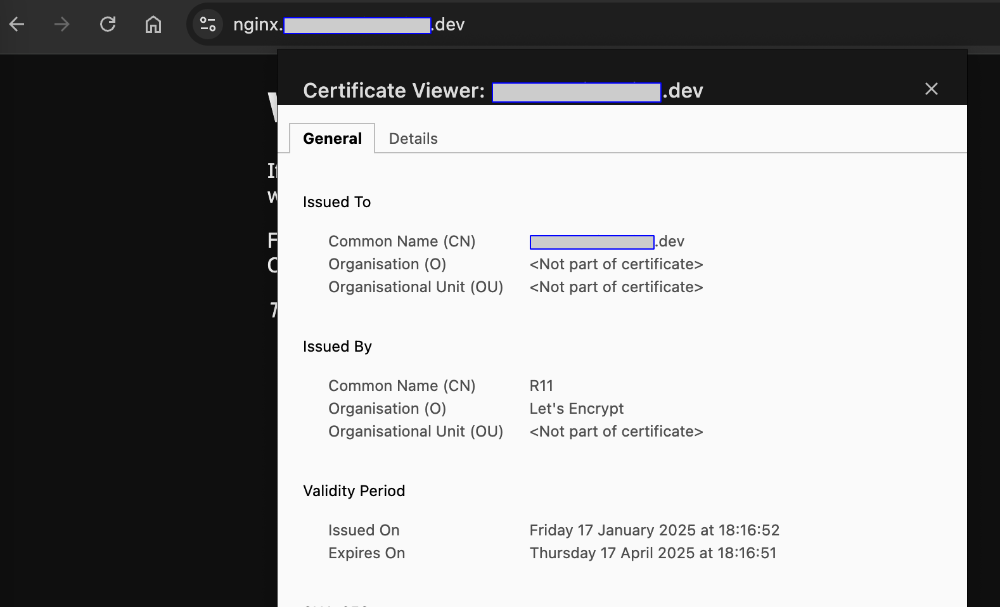

# Test creating an Ingress Route using Traefik with valid TLS certificates

Documentation:

- [Traefik & Kubernetes](https://doc.traefik.io/traefik/routing/providers/kubernetes-crd/)


## File's replacement summary

- [test-b-nginx-certificate-prod.yaml](test-b-nginx-certificate-prod.yaml)
    - Replace `<your_domain>`

- [test-c-nginx-ingressroute-staging.yaml](test-c-nginx-ingressroute-staging.yaml)
    - Replace `<your_domain>`


## Create a Canonical Name DNS record in Cloudflare for your Ingress Route

- Login to CloudFlare, create a CNAME (Canonical Name) DNS record to point to the previously created A record `homelab-traefik.<your_domain>`

    

- Create a namespace called test-web
    ```sh
    kubectl create ns test-web
    kubectl get ns
    ```

- Create a new deployment using this template [test-a-nginx-deployment.yaml](test-a-nginx-deployment.yaml)

    ```sh
    kubectl apply -f test-a-nginx-deployment.yaml
    ```

- Create a Service and Ingress Route using this file [test-b-nginx-ingressroute-prod.yaml](test-b-nginx-ingressroute-prod.yaml). 

    > Note:
    >
    > The service `nginx-deploy-main` won't have an external ip assigned. 
    >
    > The IngressRoute will use the same TLS certificate stored in Traefik. The certificate's namespace should be created in the same place as the IngressRoute.

    ```sh
    code test-b-nginx-ingressroute-prod.yaml
    # Replace the domain with your own.
    
    kubectl apply -f test-b-nginx-ingressroute-prod.yaml
    ```

    


- Then open a browser and navigate to [https://nginx.<your_domain>/](https://nginx.<your_domain>/). Inspect the certificate and confirm it's valid.

    

- You can delete the test objects

    ```sh
    kubectl delete -f test-b-nginx-ingressroute-prod.yaml 
    kubectl delete -f test-a-nginx-deployment.yaml 
    kubectl delete ns test-web 
    ```


