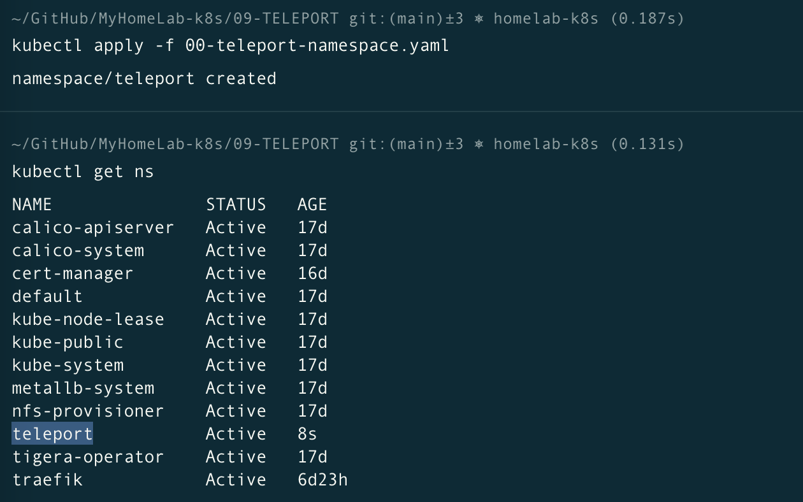
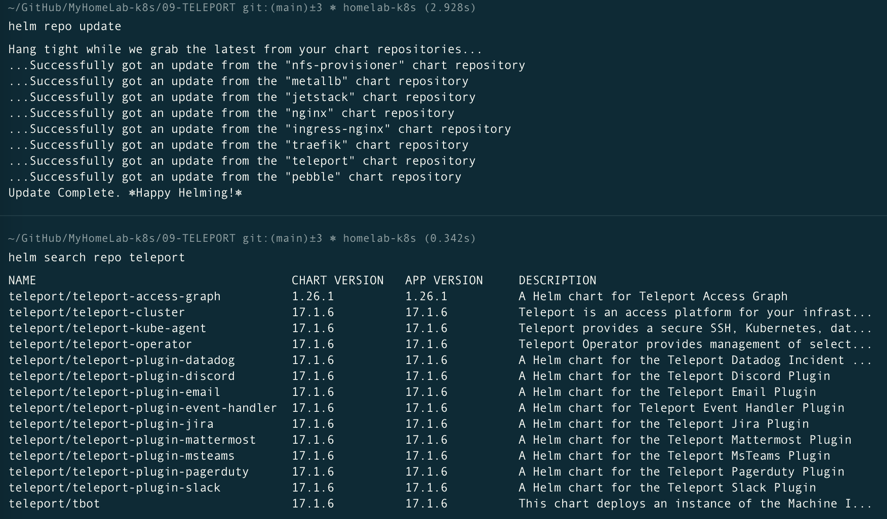
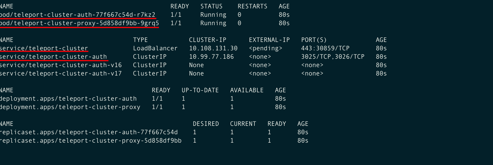
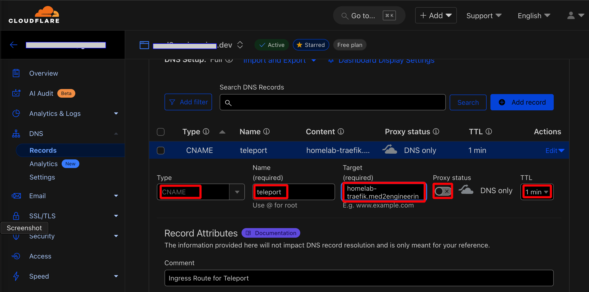
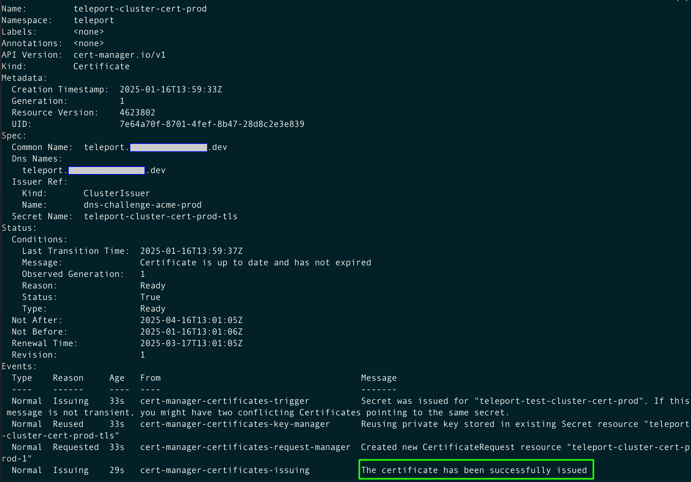
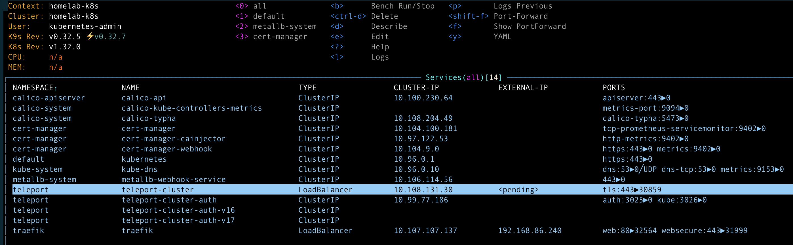

# Installation of Teleport on Premise on the Kubernetes Cluster using the Helm Chart

Official Documentation: [Deploy Teleport on Kubernetes](https://goteleport.com/docs/admin-guides/deploy-a-cluster/helm-deployments/kubernetes-cluster/)

## Prerequisites

- A running Kubernetes cluster >= v1.17.0
- Traefik installed 
- A Certificate Manager installed
- A registered domain name
- A persistent volume that the Auth Service can use for storing cluster state
- `kubectl` command-line tool configured to interact with your cluster
- `helm` command-line tool installed on your local machine  >= 3.4.2
- `tsh` command-line tool v16.4.12+ installed on your local machine. You can download this from our [installation page](https://goteleport.com/docs/installation/).


## File's replacement summary

- [01-teleport-values.yaml](01-teleport-values.yaml)
    - Replace `<your_email>`
    - Replace `<your_domain>`

- [02-teleport-certificate-prod.yaml](02-teleport-certificate-prod.yaml)
    - Replace `<your_domain>`

- [03-teleport-ingressroute-prod.yaml](03-teleport-ingressroute-prod.yaml)
    - Replace `<your_domain>`


## Download the Teleport Helm Repository, modify the configuration and deploy it

- Create a new namespace called `teleport`, using this file [00-traefik-namespace.yaml](00-traefik-namespace.yaml).

    ```sh
    kubectl apply -f 00-teleport-namespace.yaml
    kubectl get ns
    ```
    

- Configure the namespace Pod Security Admission, which enforces security standards on pods in the namespace:
    ```sh
    kubectl label namespace teleport 'pod-security.kubernetes.io/enforce=baseline'
    ```

- Set he kubectl context to the namespace to save some typing.
    ```sh
    kubectl config set-context --current --namespace=teleport
    ```

- Add the Teleport Helm repository.

    ```sh
    helm repo add teleport https://charts.releases.teleport.dev
    helm repo update
    ```
    


- Search for all the charts for the installed repository. You should find one called **teleport/teleport-cluster**
    ```sh
    helm search repo teleport
    ```

- Download the values file to configure the helm chart.
    ```sh
    cd ~/Documents/MyHomelab-k8s/09-TELEPORT/
    helm show values teleport/teleport-cluster > 01-teleport-values.yaml
    ``` 

- Then open this file in a editor, and modify the following entries in the configuration.

    - `clusterName: "teleport.<your_domain>"`

    - `proxyListenerMode: "multiplex"`

    - `acme: true`

    - `acmeEmail: <your_email>`

    


- Deploy the Traefik helm chart, using this file [01-teleport-values.yaml](01-teleport-values.yaml).

    ```sh
    helm install teleport-cluster teleport/teleport-cluster --create-namespace --values 01-teleport-values.yaml
    watch kubectl get all -n teleport
    ```

    

- If the installation fails, use this command to uninstall the helm, make sure all the resources have been removed and try again.

    ```sh
    helm uninstall teleport-cluster
    watch kubectl get all -n teleport
    ```


## Create a Canonical Name DNS record in Cloudflare for your Ingress Route

- Login to CloudFlare, create a CNAME (Canonical Name) DNS record to point to the previously created A record `homelab-traefik.<your_domain>`

    

- Create a new **Production**  certificate, using the Cluster Issuer previously created `dns-challenge-acme-prod`. Use this file [02-teleport-certificate-prod.yaml](02-teleport-certificate-prod.yaml), which will create a secret named `nginx-test-cluster-cert-prod-tls`.

    > ⚠️ **Warning**: 
    >
    > - You should replace this domain with your own.
    >
    > - The namespace the Certificate should be created in the same place as the IngressRoute

    ```sh
    kubectl apply -f 02-teleport-certificate-prod.yaml

    watch kubectl describe certificates teleport-cluster-cert-prod -n teleport

    kubectl get secret teleport-cluster-cert-prod-tls -n teleport -o jsonpath='{.data.tls\.crt}' | base64 -d | openssl x509 -text
    ```
    


- Create an Ingress Route using this file [03-teleport-ingressroute-prod.yaml](03-teleport-ingressroute-prod.yaml). 
    
    The Ingress Route will use the secretName `teleport-cluster-cert-prod-tls`.

    > Note:
    >
    > The namespace the Certificate should be created in the same place as the IngressRoute

    ```sh
    kubectl apply -f 03-teleport-ingressroute-prod.yaml
    ```
    


- Then open a browser and navigate to [https://teleport.<your_domain>/](https://teleport.<your_domain>/). Inspect the certificate and confirm it's valid.

    


## Accessing Teleport

Once installed, you can access Teleport using the service created in the `teleport` namespace. Use `kubectl port-forward` to access it locally:

```sh
kubectl port-forward svc/teleport-proxy 3080:3080
```

Open your browser and navigate to `http://localhost:3080` to access the Teleport web UI.

